# System Architecture — AI UI Testing Tool

> **What this document is.** A single source of truth for understanding how the
> whole project works: the moving parts, how they talk to each other, and how
> data flows from "a user pastes a URL" to "a polished test report." It is written
> to be read top-to-bottom by someone new to the codebase. Every file and module
> named here exists in the repository.

---

## Table of contents

1. [What the tool does (in one minute)](#1-what-the-tool-does-in-one-minute)
2. [System architecture](#2-system-architecture)
3. [Agent workflow architecture](#3-agent-workflow-architecture)
4. [Knowledge retrieval architecture](#4-knowledge-retrieval-architecture)
5. [PostgreSQL integration](#5-postgresql-integration)
6. [Crawl → Design → Execute → Evolve lifecycle](#6-crawl--design--execute--evolve-lifecycle)
7. [Migration Check (carry tests to a new deployment)](#7-migration-check-carry-tests-to-a-new-deployment)
8. [Final report rendering](#8-final-report-rendering)
9. [Appendix: all Mermaid diagrams in one place](#9-appendix-all-mermaid-diagrams)

---

## 1. What the tool does (in one minute)

You give it a **website URL**. Four AI agents then take turns:

1. **Discoverer** — opens the site in a real browser, explores it, and writes a
   plain-English **test plan** (a Markdown list of user flows worth testing).
2. **Designer** — turns each scenario in that plan into a runnable **Playwright
   test** (`.spec.ts` files).
3. **Tester** — runs the tests, and for every failure it tries to **repair** the
   test (better selectors, fixed assertions). Anything it cannot fix it
   quarantines with `test.fixme()`.
4. **Reporter** — aggregates all the results and uses Claude to write a
   human-readable **report** (summary, issues, recommended fixes), rendered in the
   web UI and as a standalone HTML file.

Around this pipeline sits a **Knowledge Layer** (a PostgreSQL + pgvector database)
that _remembers_ every past run, so future runs can **reuse existing tests**,
borrow **patterns from other apps**, and apply **fixes that worked before**.

The whole thing is a **Next.js web app** (React 19 + Chakra UI) that lets you
launch runs, watch live progress, and browse reports.

There is also a second, additive mode — **Migration Check** (Section 7) — that
skips the agents entirely: it carries an app's already-proven tests to a _new
deployment of the same app_ (e.g. Lovable → SAP BTP) and reports a before/after
**regression diff**, so you can confirm a re-host didn't break anything.

**Tech stack at a glance:** Next.js 15 / React 19 / TypeScript, Chakra UI,
`@anthropic-ai/claude-agent-sdk` (drives the agents) + `@anthropic-ai/sdk` (the
Reporter narrative), Playwright + `@playwright/cli` (browser automation),
PostgreSQL + `pgvector` (knowledge), local Hugging Face embeddings
(`Xenova/bge-small-en-v1.5`), and Langfuse/OpenTelemetry for tracing.

---

## 2. System architecture

### 2.1 The big picture

The system is organized into seven cooperating layers. The diagram below shows
who talks to whom.

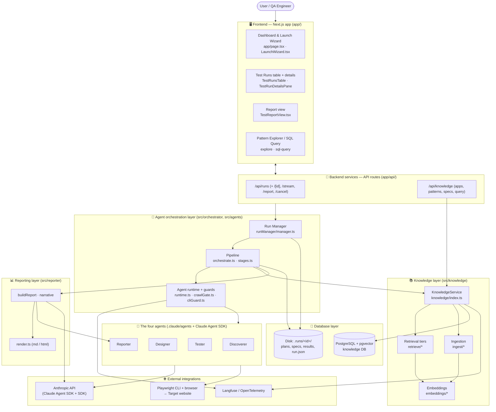

### 2.2 What each layer is responsible for

| Layer                         | Where it lives                                     | Responsibility                                                                                                            |
| ----------------------------- | -------------------------------------------------- | ------------------------------------------------------------------------------------------------------------------------- |
| **Frontend components**       | `app/` (React components, pages)                   | Launch runs, watch live progress over SSE, render reports, explore the knowledge base.                                    |
| **Backend services**          | `app/api/**/route.ts`                              | Thin HTTP endpoints: create/list/cancel runs, stream progress, serve reports, query knowledge.                            |
| **Agent orchestration layer** | `src/runManager`, `src/orchestrator`, `src/agents` | Owns a run's life (start/cancel/persist), runs the four-stage pipeline, and enforces code-level guardrails on the agents. |
| **Database layer**            | Disk under `.runs/` + PostgreSQL                   | Per-run artifacts on disk; long-term cross-run memory in Postgres.                                                        |
| **Knowledge layer**           | `src/knowledge`                                    | Turns finished runs into reusable knowledge and feeds it back into future runs.                                           |
| **Reporting layer**           | `src/reporter`                                     | Builds the canonical report object and renders it to Markdown/HTML.                                                       |
| **External integrations**     | Anthropic API, Playwright, Langfuse                | The LLM, the real browser, and observability.                                                                             |

### 2.3 Key design principles (why the code looks the way it does)

- **Graceful degradation everywhere.** The knowledge DB, login credentials,
  business context, and Langfuse tracing are all _optional_. With none of them
  configured, the pipeline still runs exactly as before — it just runs "cold."
  The knowledge service even has a `DisabledKnowledgeService` that returns safe
  empty results so callers never have to check `if (enabled)`.
- **Boundaries are enforced in code, not just prompts.** The agents are told what
  to do, but `crawlGate.ts` and `cliGuard.ts` install Claude Agent SDK _hooks_
  that hard-deny out-of-scope navigation and non-CLI browser tools at the tool
  boundary — so the limits hold even if the model ignores its instructions.
- **The runner owns the truth.** Agents describe results subjectively; the actual
  pass/fail/flaky verdict comes from running Playwright and parsing
  `results.json` (`src/results/parse.ts`).

---

## 3. Agent workflow architecture

### 3.1 The four agents and their order

The pipeline always runs the same sequence. It is wired in
`src/orchestrator/orchestrate.ts` (`runPipeline`), which calls the stage functions
in `src/orchestrator/stages.ts`. The agent _personalities_ (system prompts,
allowed tools) live as Markdown files in `.claude/agents/`.

The board-level overview below is the quickest way to grasp the four agents and
who hands what to whom (User → Discoverer → Designer → Tester → Reporter, with
the Knowledge DB and the real browser on the side). The Mermaid sequence diagram
that follows is the precise, code-level version of the same flow.

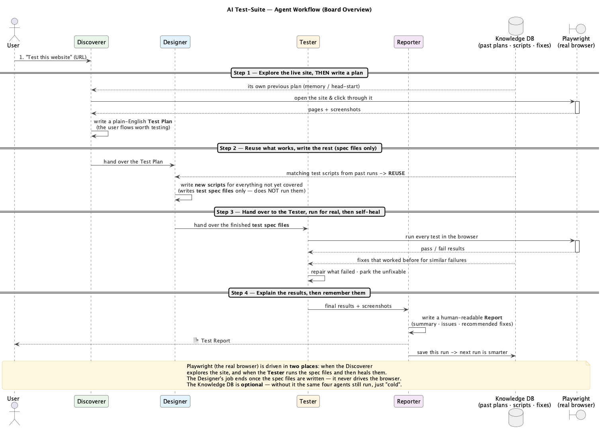

> Source for this diagram lives in `docs/board-uml.puml` (PlantUML); the rendered
> PNG/SVG are `docs/ai-test-suite-workflow.png` / `.svg`. See
> `docs/board-uml-guide.md` for a panel-by-panel reading guide. Note this overview
> labels each lifeline by its **agent role**; the Mermaid diagram below additionally
> breaks out the Orchestrator, KnowledgeService, and Validator as separate
> participants.

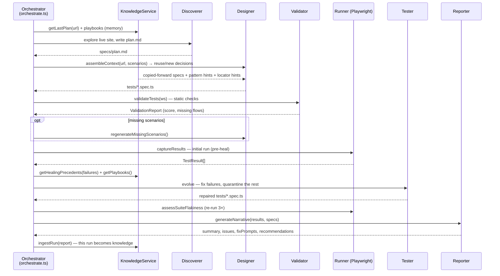

### 3.2 Each stage: inputs, outputs, and how context is passed

Context is passed between stages **through the run workspace on disk** (a folder
at `.runs/<runId>/`). Stage N writes files; stage N+1 reads them. The
`Workspace` object (`src/agents/workspace.ts`) hides the exact paths behind
operations like `writePlan`, `readPlan`, `readGeneratedSpecs`, and `runSuite`.

| Stage                      | Function (file)                                                    | Reads                                                                                                 | Writes / Produces                                                                  |
| -------------------------- | ------------------------------------------------------------------ | ----------------------------------------------------------------------------------------------------- | ---------------------------------------------------------------------------------- |
| **1. Discoverer**          | `discoverTests` (`stages.ts`)                                      | Live website; optional prior plan (`getLastPlan`), playbooks, business context, login creds           | `specs/plan.md`; `.auth/storageState.json` (if login enabled)                      |
| **2. Designer**            | `designTests` (`stages.ts`)                                        | `plan.md`; knowledge context pack (reuse decisions, pattern hints, locator hints); saved auth session | `tests/*.spec.ts` (one file per scenario); copies reused specs forward             |
| **2b. Validator**          | `validateTests` → `validateSuite` (`validator/validate.ts`)        | Generated specs + plan                                                                                | `ValidationReport` (score, errors, warnings, missing flows) — _no LLM, no browser_ |
| **2c. Completeness retry** | `regenerateMissingScenarios` (`stages.ts`)                         | List of planned scenarios with no spec                                                                | The missing `tests/*.spec.ts` only                                                 |
| **3. Runner + Tester**     | `captureResults` + `evolveTests` (`results/parse.ts`, `stages.ts`) | Specs; initial `results.json`; validation findings; healing precedents; playbooks                     | Repaired specs; `test.fixme()` for the unfixable                                   |
| **3b. Flake check**        | `assessSuiteFlakiness` (`results/parse.ts`)                        | The suite                                                                                             | Re-runs 3× to flag non-deterministic tests; `flakeRate`                            |
| **4. Reporter**            | `generateNarrative` + `buildReport` (`reporter/`)                  | Final results, specs, plan, coverage, screenshots                                                     | `RunReport` (canonical JSON)                                                       |

**How memory flows in (knowledge → agents):**

- The **Discoverer** is given its own _previous plan_ for the same URL as
  reference "memory" (best-effort, budgeted to ~4k tokens) plus any trusted
  _playbooks_. It still has to crawl the live site — memory is an accelerator, not
  a substitute. Importantly, the Discoverer carries **no reuse knowledge**;
  de-duplication against past runs is the Designer's job alone (one decision
  layer — see `docs/adr/`).
- The **Designer** receives a _context pack_ from `assembleContext()`: per-scenario
  `reuse` / `new` decisions, the source code of confidently-matched specs (copied
  forward into the workspace so the suite stays runnable), cross-app _pattern
  hints_, and _resilient-locator hints_ distilled from past heals.
- The **Tester** receives _healing precedents_ (specific before→after fixes for
  similar failures) and trusted playbooks.

### 3.3 Human approval points

This pipeline is **fully autonomous** — there is no human-in-the-loop approval
gate between stages. A human's only control levers are:

- **Launch configuration** (URL, crawl mode, max pages, scenario budget, an
  optional free-text _focus_ directive) via the Launch Wizard.
- **Cancellation.** `POST /api/runs/[id]/cancel` aborts the run. The orchestrator
  checks `checkCancelled()` at every stage boundary and throws `CancelledError`,
  which propagates an `AbortController` signal that kills the agent subprocess.

> Note: the _read-only SQL query_ tool (Section 5.4) does have a human review
> step — Claude proposes the SQL, the user reads it, then clicks "Execute" — but
> that is a separate feature, not part of the test pipeline.

### 3.4 The guardrails (how agents are kept in scope)

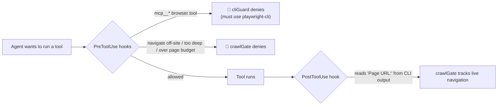

- **`cliGuard.ts`** blocks the entire `mcp__` tool namespace, forcing all browser
  control through `npx playwright-cli` (which is token-efficient and the surface
  the crawl gate understands).
- **`crawlGate.ts`** parses each `playwright-cli` command, enforces depth and
  page-count limits per crawl mode, denies off-origin navigation, and captures
  pre/post screenshots of each interaction (which later appear in the report).
- Both sets of hooks are combined with `mergeHooks()` and passed to `runAgent`.

---

## 4. Knowledge retrieval architecture

The Knowledge Layer is what makes the tool get smarter over time. Its public face
is the **`KnowledgeService`** (`src/knowledge/index.ts`). When no
`KNOWLEDGE_DATABASE_URL` is set it returns a `DisabledKnowledgeService` (all calls
return empty/null), so everything below is purely additive.

### 4.1 The required flow (User URL → Designer)

This is the exact sequence the prompt asks for, and it matches the reference
diagram in `docs/kb_arch.md`:

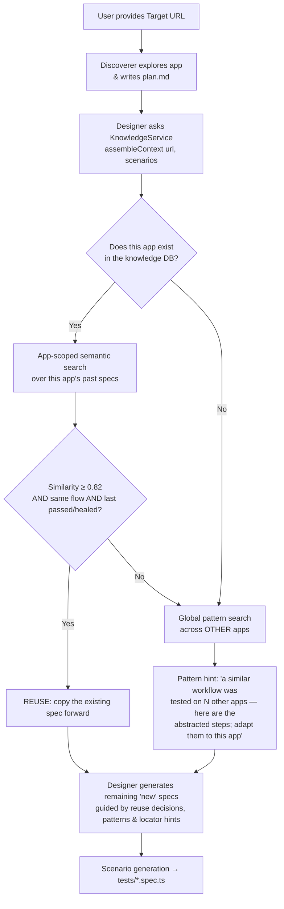

### 4.2 The retrieval tiers

There are three distinct retrieval tiers, each with its own purpose, scope, and
similarity threshold. All similarity is **cosine similarity** over 384-dim
embeddings (or a lexical token-overlap fallback when embeddings are unavailable).

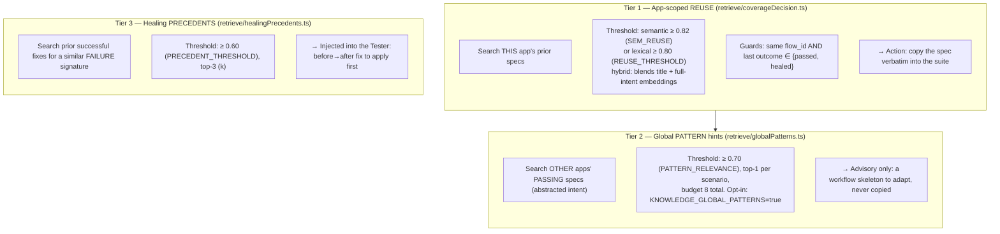

- **App-scoped retrieval (reuse).** For each planned scenario, `decideForSpecs`
  scores it against this app's stored specs. It uses a _hybrid_ score — the max of
  a lexical overlap coefficient and a blended semantic score (`0.5 × title +
0.5 × title+steps`). It only reuses when the score clears `0.82`, the matched
  spec last **passed or healed**, and the **flow ids match** (the "Fix 2"
  cross-flow guard prevents, say, a newsletter "Submit" reusing a support
  "Submit").
- **Global pattern retrieval.** For scenarios decided `new`, the tool looks across
  _other_ apps' passing specs for a similar _abstracted_ workflow (entities,
  prices, ids stripped via `abstractIntent.ts`). The match is advisory — the
  Designer is told to reuse the _pattern_, never the selectors.
- **Historical report / plan retrieval.** `getLastPlan(url)` returns the most
  recent prior plan markdown as Discoverer "memory." The raw report JSON is also
  stored (`raw_reports`) and is the source from which reused spec code is
  rehydrated.
- **Healing precedents.** When tests fail, `getHealingPrecedents` finds prior
  before→after repairs for similar failures (signatures normalized by
  `heal/signature.ts`) and feeds them to the Tester.

### 4.3 Context assembly (how it all gets into the prompt)

`assembleContext()` in `src/knowledge/assemble/contextPack.ts` is the single
function that bundles everything for the Designer:

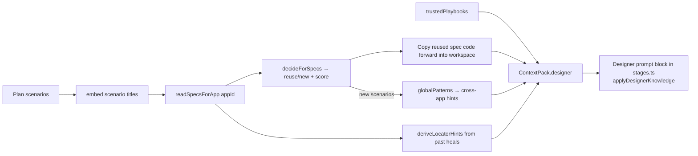

Reused specs are **not** pasted into the prompt — they are written into
`tests/` tagged with a `// @kp-reused` marker, and the prompt simply tells the
Designer _"these are already covered, do not regenerate; build everything else."_
This keeps the suite runnable without spending prompt tokens on existing code.

Every knowledge call is wrapped by `withKb()` (`src/knowledge/safety.ts`), which
adds a timeout (~4s) and catch-all so a slow or broken DB **can never stall or
fail a run** — it just yields no hints.

### 4.4 How agents consume knowledge — summary

| Agent      | Knowledge consumed                                                                  | Source function                        |
| ---------- | ----------------------------------------------------------------------------------- | -------------------------------------- |
| Discoverer | Prior plan ("memory") + trusted playbooks                                           | `getLastPlan`, `getPlaybooks`          |
| Designer   | Reuse decisions, copied specs, pattern hints, locator hints, playbooks              | `assembleContext`                      |
| Tester     | Healing precedents (before→after) + playbooks                                       | `getHealingPrecedents`, `getPlaybooks` |
| Reporter   | (none directly — it summarizes the run; its output is _ingested back_ as knowledge) | `ingestRun`                            |

---

## 5. PostgreSQL integration

The knowledge database is **optional**. It is enabled by setting
`KNOWLEDGE_DATABASE_URL`. On Next.js startup, `instrumentation.ts` auto-applies
any pending migrations so the schema is never out of sync with the writer.

### 5.1 Connection layer and repositories

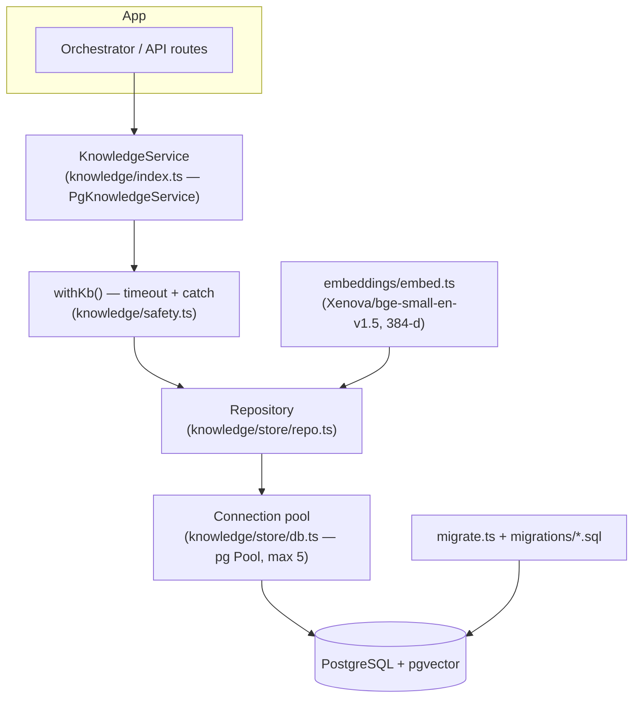

- **`store/db.ts`** — creates a `pg` connection `Pool` (max 5 connections, 3s
  connect timeout so a down DB fails fast).
- **`store/repo.ts`** — the repository: all SQL reads/writes (insert a run's
  specs/results/heals, read specs for an app, nearest-neighbour vector searches via
  HNSW indexes).
- **`store/migrate.ts` + `store/migrations/*.sql`** — versioned schema, tracked in
  a `schema_migrations` table and applied idempotently.
- **`embeddings/embed.ts`** — produces L2-normalized 384-dim vectors locally with
  a Hugging Face model; cosine similarity is therefore a dot product.

### 5.2 Tables involved

Created across the migration files in `src/knowledge/store/migrations/`:

| Table                | Purpose                                                                                                                                                                                                                                         |
| -------------------- | ----------------------------------------------------------------------------------------------------------------------------------------------------------------------------------------------------------------------------------------------- |
| `apps`               | One row per app (normalized URL/origin); first/last seen, run count.                                                                                                                                                                            |
| `runs`               | One row per completed run (app, url, status, crawl mode, time).                                                                                                                                                                                 |
| `specs`              | Generated test files: file, title, flow id, content hash, `reused` flag, plus several **`vector(384)`** columns — `embedding` (title+steps), `pattern_embedding` (abstracted intent), `title_embedding` (title only) — each with an HNSW index. |
| `plan_scenarios`     | The scenario titles the Discoverer planned (tokenized).                                                                                                                                                                                         |
| `test_results`       | Outcome per flow per run (`passed` / `healed` / `failed` / `fixme`) + failure reason.                                                                                                                                                           |
| `coverage_snapshots` | Per-run coverage aggregate (curated total, tested count, percent, missing flows).                                                                                                                                                               |
| `flows`              | Curated + discovered flows per app.                                                                                                                                                                                                             |
| `edges`              | Typed graph relations (`PRODUCED`, `TESTS`, `COVERS`) for graph-style queries.                                                                                                                                                                  |
| `raw_reports`        | The verbatim `RunReport` JSON (the rebuild source for reused spec code).                                                                                                                                                                        |
| `healing_events`     | Append-only repairs (failure signature + `failure_embedding`, before/after snippet, strategy, outcome).                                                                                                                                         |
| `playbooks`          | Distilled, evidence-linked principles with a trust gate (`episodic` → `trusted`).                                                                                                                                                               |
| `distill_watermark`  | Single-row bookmark for incremental playbook distillation.                                                                                                                                                                                      |

### 5.3 How execution data is stored and retrieved

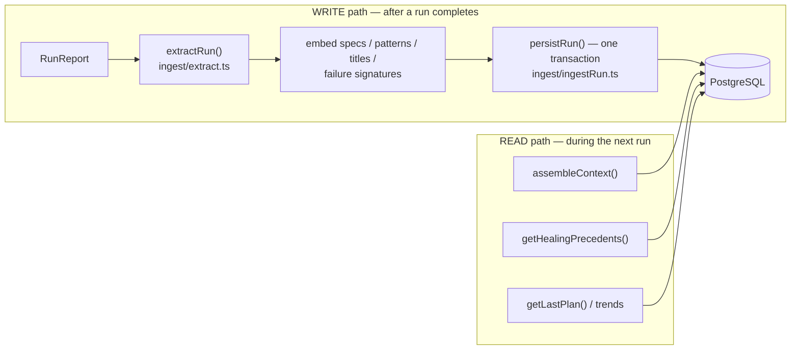

- **Storing.** When the pipeline finishes, `runPipeline` calls
  `knowledge.ingestRun(report)`. `extract.ts` normalizes the report (specs,
  flows, results, coverage, graph edges, and healing events reconstructed by
  _diffing_ pre-heal vs post-heal specs in `heal/captureHeal.ts`). It then embeds
  the text and `persistRun()` writes everything in **one transaction**, idempotent
  by `run_id`. A safety check refuses to ingest synthetic `test-<uuid>` runs into a
  non-test database.
- **Retrieving.** The next run reads back through the same `KnowledgeService`
  methods used for the retrieval tiers (Section 4), plus trend queries
  (`getKnowledgeReuseTrend`, `getHealProvenanceTrend`) that power the UI charts.

### 5.4 AI-generated SQL (the read-only query tool)

The **SQL Query** UI lets a user ask a question in English; Claude translates it
to SQL; the user reviews and runs it. Two layers of defense live in
`src/knowledge/sql/`:

1. **`guard.ts` static validation** — the statement must be a single
   `SELECT`/`WITH`, with all write keywords (INSERT/UPDATE/DELETE/DROP/…) forbidden
   (comments and string literals stripped before checking).
2. **`guard.ts` execution limits** — runs inside a `READ ONLY` transaction with a
   5-second `statement_timeout` and a 500-row hard cap.

`schema.ts` provides the read-only schema description handed to Claude for the
translation step (`/api/knowledge/query/translate`); execution happens via
`/api/knowledge/query/run`.

### 5.5 The relationship: agents ↔ database ↔ knowledge storage

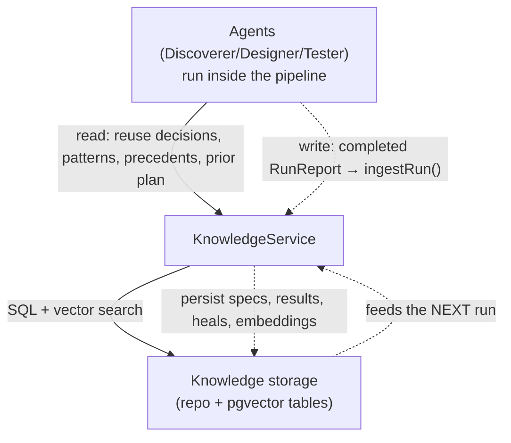

The agents never touch SQL directly — they only ever produce/consume artifacts.
The `KnowledgeService` is the _only_ component that talks to PostgreSQL.

---

## 6. Crawl → Design → Execute → Evolve lifecycle

This is the end-to-end story of a single run, from URL to report, with the files,
modules, and artifacts at each stage.

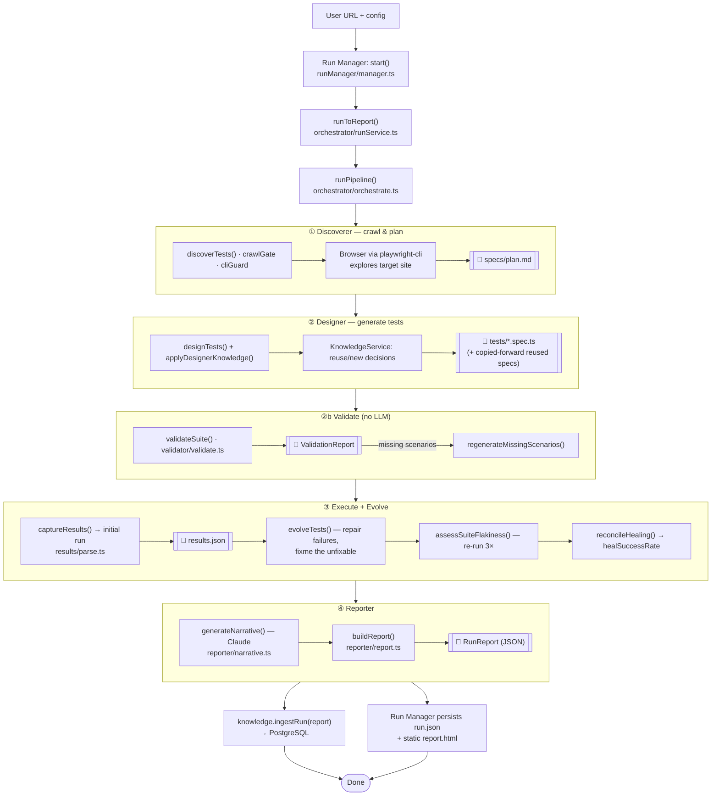

**Stage-by-stage detail:**

| Stage                  | Files / modules                                                                                                                                                               | Artifacts produced                                                              |
| ---------------------- | ----------------------------------------------------------------------------------------------------------------------------------------------------------------------------- | ------------------------------------------------------------------------------- |
| **Start**              | `runManager/manager.ts`, `runStore/store.ts`, `orchestrator/runService.ts`                                                                                                    | `.runs/<id>/run.json` (status `pending`)                                        |
| **① Crawl & plan**     | `stages.ts:discoverTests`, `agents/runtime.ts`, `agents/crawlGate.ts`, `agents/cliGuard.ts`, agent `.claude/agents/playwright-test-discoverer.md`                             | `specs/plan.md`, `.auth/storageState.json`, `screenshots/*.png`                 |
| **② Design**           | `stages.ts:designTests` + `applyDesignerKnowledge`, `knowledge/assemble/contextPack.ts`, agent `playwright-test-designer.md`                                                  | `tests/*.spec.ts`                                                               |
| **②b Validate**        | `validator/validate.ts`                                                                                                                                                       | `ValidationReport` (in-memory)                                                  |
| **③ Execute & evolve** | `results/parse.ts` (`captureResults`, `assessSuiteFlakiness`, `reconcileHealing`), `agents/workspace.ts:runSuite`, `stages.ts:evolveTests`, agent `playwright-test-tester.md` | `results.json`, repaired specs, `flakeRate`, `healSuccessRate`, `healingEvents` |
| **④ Report**           | `reporter/narrative.ts`, `reporter/report.ts`, `reporter/successRate.ts`, `claude/client.ts`                                                                                  | `RunReport`                                                                     |
| **Persist & learn**    | `runManager/persistence.ts`, `knowledge/ingest/ingestRun.ts`                                                                                                                  | `run.json` (final), `report.html`, knowledge rows in Postgres                   |

**Crawl scope** is decided by the `CrawlMode` (`src/types.ts`): `direct` (entry
page only, depth 0), `standard` (depth 1), `deep` (depth 2), `aggressive` (depth
10). The number of scenarios is capped by `effectiveScenarioCap` (page budget ×
per-mode rate, hard-capped at `MAX_TOTAL_TESTS`), so the Discoverer and Designer
share one source of truth for the budget.

---

## 7. Migration Check (carry tests to a new deployment)

**What it is.** A pure rehost — the _same_ app moved to a new host (Lovable → SAP
BTP, a staging clone, a new CDN) — should behave identically. Migration Check
proves that. It takes tests already proven on the **source** app, points them at
the **target** deployment, runs them, and reports a per-spec **before/after
diff** that separates _real regressions_ from environment noise. It is a
deliberately **isolated, additive** feature: it reuses pipeline helpers
(`Workspace`, suite execution, flake separation, `buildReport`) as library calls
but **never touches the normal run flow** and **skips the Discoverer, Designer,
and — by default — the Tester** (report-first: don't paper over regressions).

All of it lives in `src/migration/`, is exposed under `app/api/migration-check/`,
and is driven by the `MigrationCheck.tsx` / `MigrationDiffView.tsx` UI. Its
artifacts live in their **own root**, `.migration-runs/<id>/`, so they can never
collide with `.runs/`.

### 7.1 The migration flow

```mermaid
flowchart TD
    U["User picks source app + target URL<br/>+ specs to carry (MigrationCheck.tsx)"] --> API["POST /api/migration-check"]
    API --> RMC["runMigrationCheck()<br/>migration/runMigrationCheck.ts"]

    RMC --> S1["① Resolve source specs<br/>sourceSpecs.ts — from Run Manager (disk/memory)"]
    S1 --> S2["② Prepare workspace (auth if creds given)<br/>originRewrite.ts swaps source origin → target"]
    S2 --> S3{"heal option?"}
    S3 -->|on| H["Tester repairs failures (evolveTests);<br/>any spec it MODIFIES is flagged 'healed'"]
    S3 -->|off (default)| RUN
    H --> RUN["③ Run + flake-separate<br/>assessSuiteFlakiness (serial, N reruns)"]
    RUN --> S4["④ Diff source vs target<br/>classify.ts + diff.ts"]
    S4 --> FP["⑤ Build-fingerprint check<br/>fingerprint.ts — same hashed assets?"]
    FP --> REP["⑥ MigrationReport (+ full targetReport)<br/>saved to .migration-runs/&lt;id&gt;/"]
    REP --> UI["MigrationDiffView — regression table,<br/>AI failure explain, Trace Viewer, edit+re-run"]
```

`runMigrationCheck` (`src/migration/runMigrationCheck.ts`) orchestrates these
phases. Every heavy dependency (workspace prep, suite run, heal, fingerprint,
persistence) is **injectable**, so the orchestration is unit-testable without a
browser, Claude, or the filesystem. Progress is emitted as `MigrationEvent`s for
the live log, and cancellation works through a `registry.ts` of in-flight
`AbortController`s (so a `POST /cancel` from one route can stop a run another
route started).

### 7.2 The phases

| Phase                 | File(s)                                            | What it does                                                                                                                                                                                                                                                                                        |
| --------------------- | -------------------------------------------------- | --------------------------------------------------------------------------------------------------------------------------------------------------------------------------------------------------------------------------------------------------------------------------------------------------- |
| **① Resolve**         | `sourceSpecs.ts`                                   | Find the source app's prior run and the proven specs to carry over. Read-only, sourced from the **Run Manager** (disk + memory), so it works even with the Postgres knowledge layer off.                                                                                                            |
| **② Prepare**         | `runMigrationCheck.ts`, `originRewrite.ts`         | Create a workspace (login wired only if credentials are supplied) and write each spec into it after a **surgical origin rewrite** — only `scheme://host[:port]` is swapped; paths, selectors, assertions, and third-party URLs are left untouched. A user-edited override is written verbatim.      |
| **③ Heal (opt-in)**   | `orchestrator/stages.ts:evolveTests`               | Off by default. When on, the **Tester** may fix failures, but any spec it had to _modify_ is flagged `healed` — a needed fix means the test didn't transfer as-is, which is surfaced, not hidden.                                                                                                   |
| **④ Run**             | `results/parse.ts:assessSuiteFlakiness`            | Runs the suite **serially** (`workers: 1`) for N reruns to flake-separate. Serial because migration replays one authenticated account against an app that persists per-user state, so parallel specs would corrupt each other.                                                                      |
| **⑤ Diff & classify** | `classify.ts`, `diff.ts`                           | Collapse each result into a `SpecClassification`. A suite-level abort (login/global-setup failure) is detected and surfaced as `setupError` — its un-run specs are an _environment_ problem, not regressions.                                                                                       |
| **⑥ Fingerprint**     | `fingerprint.ts`                                   | Loads source and target in a real browser and compares the **hashed asset basenames** (Vite/Lovable content-hash bundles) they reference. Matching filenames ⇒ "same build", which both confirms identity and validates verbatim spec reuse. Never throws — a failure downgrades to status `error`. |
| **Report & persist**  | `reporter/report.ts:buildReport`, `persistence.ts` | Assembles a `MigrationReport` (the diff, summary counts, fingerprint, and a full `targetReport` for drill-down via the normal report view) and writes it under `.migration-runs/<id>/`.                                                                                                             |

### 7.3 The classification — surfacing regressions, not hiding them

The guiding rule (`classify.ts`): a migration check exists to **surface**
regressions, so the bar for calling a failure "noise" is deliberately high. A
failure is only `infra` when it clearly looks like an _environment_ difference
(auth / SSO / network / TLS — matched by an explicit pattern list). Anything that
looks like "the element or page changed" (a locator timeout, a navigation
failure) is treated as a **real behavioral regression**.

| Classification | Meaning                                                               |
| -------------- | --------------------------------------------------------------------- |
| `ok`           | Passed on the target — migration-safe.                                |
| `healed`       | Passed only after an automated fix — didn't transfer as-is; review.   |
| `flaky`        | Inconsistent across reruns — not a trustworthy signal.                |
| `infra`        | Failed for login/network/TLS reasons — ignore.                        |
| `behavioral`   | Passed on source, fails consistently on target — **real regression.** |
| `pre-existing` | Failed on the source too — not introduced by the migration.           |

### 7.4 The dashboard, AI explanations, and the Trace Viewer

`MigrationCheck.tsx` drives the launch + live log; `MigrationDiffView.tsx`
renders the result — a regression-first table plus several drill-downs:

- **AI failure explanation.** `POST /api/migration-check/explain` →
  `explain.ts`. Two layers: a deterministic heuristic (instant, no API) and an
  optional Claude pass that reads the spec + failure for a richer answer. The LLM
  path falls back to the heuristic on any error or missing key, so the inspector
  always gets a usable answer.
- **Open Playwright Trace.** The migration workspace runs Playwright with
  `trace: 'retain-on-failure'`, so each failed spec leaves a `trace.zip`.
  `trace.ts` resolves that file from the run's `results.json` (matched by spec
  basename, last attempt wins), and `GET /api/migration-check/[id]/trace?file=…`
  streams it. The viewer itself is **vendored same-origin**: `bin/copy-trace-viewer.mjs`
  copies Playwright's Trace Viewer into `public/trace-viewer` on `postinstall` /
  `predev` / `prebuild`, because `trace.playwright.dev` (an HTTPS site) can't fetch
  a `localhost` trace without tripping mixed-content / Local Network Access.
  Suite artifacts are written to a **per-run** `test-results/` dir (absolute
  `--output`) so a later run can't wipe an earlier run's traces.
- **Edit & re-run.** A user can edit a carried-over spec against the target and
  re-run; the edited code is passed as a `specOverride` and run **verbatim** (no
  origin rewrite), since it already targets the new deployment.
- **Saved environments.** `MigrationEnvironment`s (label + target URL + optional
  path prefix / IdP) are stored per source app so repeat checks pre-fill — but
  **credentials are never persisted**, only where the app lives.

### 7.5 Auth: only when there's a login, and public-site detection

Migration reuses the normal suite's `global-setup.ts` auth via the `TARGET_*`
env contract (`withAuthEnv` exports them around the run). Two safeguards keep
this honest:

- **Login is wired only when credentials are actually supplied** — a target with
  no login wall skips setup entirely (enabling it without creds would make
  global-setup fail).
- **Public-site detection (a workspace-level safety net, `agents/workspace.ts`).**
  Credentials being _set_ is not proof the app _has_ a login. Before aborting on a
  missing login, global-setup now briefly polls for a real username/password
  field; if none ever renders, it treats the app as public, persists the anonymous
  state, and runs the suite unauthenticated rather than failing. The new
  `Workspace.disableAuth()` complements this in normal runs — when the Discoverer
  reports no login wall, it strips the auth scaffolding so the suite stays truthful.

### 7.6 API surface

| Endpoint                                                 | Purpose                                                                    |
| -------------------------------------------------------- | -------------------------------------------------------------------------- |
| `GET/POST /api/migration-check`                          | List saved checks (with summary counts) / start a check in the background. |
| `GET /api/migration-check/[id]`                          | Poll one check's status, progress events, and report.                      |
| `POST /api/migration-check/[id]/cancel`                  | Stop an in-flight check (via the abort registry).                          |
| `GET /api/migration-check/[id]/trace`                    | Stream the retained Playwright `trace.zip` for one failed spec.            |
| `GET /api/migration-check/source-apps`                   | Apps with prior runs, offered as migration sources.                        |
| `GET /api/migration-check/source-specs`                  | The proven specs of a source run, to choose which to carry.                |
| `GET /api/migration-check/target-urls`                   | Previously-used target URLs for an app.                                    |
| `POST /api/migration-check/explain`                      | AI/heuristic explanation of why a migrated spec failed.                    |
| `GET/POST/DELETE /api/migration-check/environments[/id]` | Manage saved target environments (no credentials stored).                  |

---

## 8. Final report rendering

### 8.1 The report generation pipeline

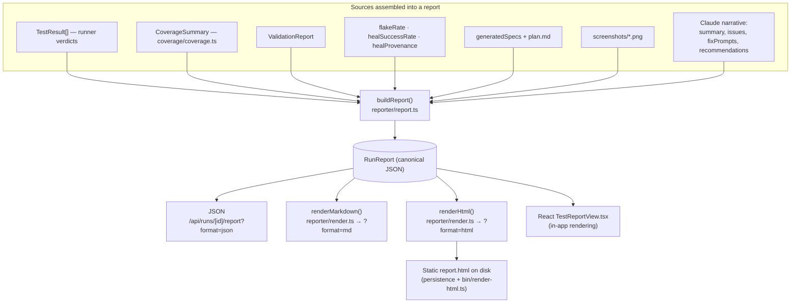

- **Sources.** `buildReport` (`src/reporter/report.ts`) is the single place a
  `RunReport` is assembled. It merges the runner's authoritative results, coverage,
  validation findings, flake/heal metrics, the generated specs, the agent
  screenshots, and the Claude-written narrative.
- **The narrative.** `generateNarrative` (`src/reporter/narrative.ts`) calls Claude
  (via `claude/client.ts`, model `claude-sonnet-4-6`) with the authoritative test
  counts and failure details, and parses back JSON: a per-test `summary`,
  `issues`, `fixPrompts` (one diagnosis + fix per failing test), `better`, and
  `recommendationsText`. The output token budget scales with test count, and the
  parser repairs truncated JSON; on total failure it degrades to an empty
  narrative rather than failing the run.
- **Markdown generation.** `renderMarkdown()` (`src/reporter/render.ts`) produces a
  structured Markdown document (summary, breakdown, results table, fix prompts,
  issues, validation findings).
- **HTML generation.** `renderHtml()` produces a **self-contained single-file HTML
  report** (embedded CSS from `app/components/TestReportView.css`, tabbed UI,
  searchable results table, screenshot lightbox, spec code viewer) viewable with no
  server. `bin/render-html.ts` (`npm run render:html -- <id>`) writes it to disk,
  and the Run Manager also writes a static `report.html` when a run reaches a
  terminal state.

### 8.2 UI rendering flow (how the report reaches the browser)

```mermaid
sequenceDiagram
    participant B as Browser (app/page.tsx)
    participant API as API routes
    participant RM as Run Manager
    participant Disk as .runs/&lt;id&gt;

    Note over B: Live progress while running
    B->>API: EventSource GET /api/runs/[id]/stream
    API->>RM: peek(id) every 400ms
    RM-->>API: new ProgressEvent[]
    API-->>B: SSE "progress" (id = index)
    Note over B,API: reconnect resumes via Last-Event-ID;<br/>: ping heartbeat every 15s

    Note over B: When the run is terminal
    API-->>B: SSE "end" { status, error }
    B->>API: GET /api/runs/[id]/report?format=json
    API->>RM: get(id) → report
    RM->>Disk: read run.json if not in memory
    RM-->>API: RunReport
    API-->>B: JSON
    B->>B: cache in reportsMap, render <TestReportView/>
```

- **Live progress** streams over **Server-Sent Events** from
  `/api/runs/[id]/stream`. The endpoint polls the in-memory run every 400ms,
  emits each `ProgressEvent` with a monotonic `id` (so a dropped connection
  resumes via `Last-Event-ID` without replay), and sends `: ping` heartbeats. The
  log panel is `TestRunDetailsPane.tsx`.
- **The finished report** is fetched as JSON and rendered in-app by
  `TestReportView.tsx` (dashboard with success-rate badge, "what was tested"
  narrative, searchable results table, and screenshot gallery). The same data is
  available as Markdown or standalone HTML via the `format` query parameter.
- **Trend charts** (`KnowledgeReuseTrend.tsx`, `HealProvenanceTrend.tsx`,
  `TrendChart.tsx`) call `/api/runs/[id]/reuse-trend` and `/heal-trend`, which read
  app-scoped history from the Knowledge Layer.

---

## 9. Appendix: all Mermaid diagrams

For quick reference, the major diagrams are grouped here by the topic they serve.

### 9.1 Overall system architecture

See [Section 2.1](#21-the-big-picture).

### 9.2 Agent interaction flow

See [Section 3.1](#31-the-four-agents-and-their-order) — the board-overview UML
(`docs/ai-test-suite-workflow.png`) and the code-level Mermaid sequence diagram —
and [Section 3.4](#34-the-guardrails-how-agents-are-kept-in-scope) (guardrails).

### 9.3 Knowledge retrieval flow

See [Section 4.1](#41-the-required-flow-user-url--designer) (URL → Designer),
[Section 4.2](#42-the-retrieval-tiers) (the three tiers), and
[Section 4.3](#43-context-assembly-how-it-all-gets-into-the-prompt) (assembly).

### 9.4 PostgreSQL integration

See [Section 5.1](#51-connection-layer-and-repositories),
[Section 5.3](#53-how-execution-data-is-stored-and-retrieved), and
[Section 5.5](#55-the-relationship-agents--database--knowledge-storage).

### 9.5 Execution lifecycle

See [Section 6](#6-crawl--design--execute--evolve-lifecycle).

### 9.6 Migration Check

See [Section 7.1](#71-the-migration-flow) (the migration flow) and
[Section 7.4](#74-the-dashboard-ai-explanations-and-the-trace-viewer) (dashboard & Trace Viewer).

### 9.7 Reporting architecture

See [Section 8.1](#81-the-report-generation-pipeline) (generation) and
[Section 8.2](#82-ui-rendering-flow-how-the-report-reaches-the-browser) (rendering).

---

### Quick file map (where to look)

| You want to understand…              | Start here                                                                        |
| ------------------------------------ | --------------------------------------------------------------------------------- |
| The whole pipeline wiring            | `src/orchestrator/orchestrate.ts`                                                 |
| What each agent stage does           | `src/orchestrator/stages.ts`                                                      |
| How agents are run + kept in scope   | `src/agents/runtime.ts`, `crawlGate.ts`, `cliGuard.ts`                            |
| Per-run files on disk                | `src/agents/workspace.ts`                                                         |
| Run lifecycle (start/cancel/persist) | `src/runManager/manager.ts`, `runStore/store.ts`                                  |
| The knowledge brain                  | `src/knowledge/index.ts`                                                          |
| Reuse / pattern / heal retrieval     | `src/knowledge/retrieve/*`, `assemble/contextPack.ts`                             |
| Database schema                      | `src/knowledge/store/migrations/*.sql`                                            |
| Report building & rendering          | `src/reporter/report.ts`, `narrative.ts`, `render.ts`                             |
| Migration Check (carry tests over)   | `src/migration/runMigrationCheck.ts`, `classify.ts`, `app/api/migration-check/**` |
| Trace Viewer (vendored, same-origin) | `src/migration/trace.ts`, `bin/copy-trace-viewer.mjs`                             |
| The web app                          | `app/page.tsx`, `app/components/*`, `app/api/**`                                  |
| Shared types & budgets               | `src/types.ts`                                                                    |

> **Keeping this current.** The most authoritative facts (thresholds, table names,
> stage order) live in the files above. If this document and the code ever
> disagree, the code wins — please update this file when the architecture changes.
