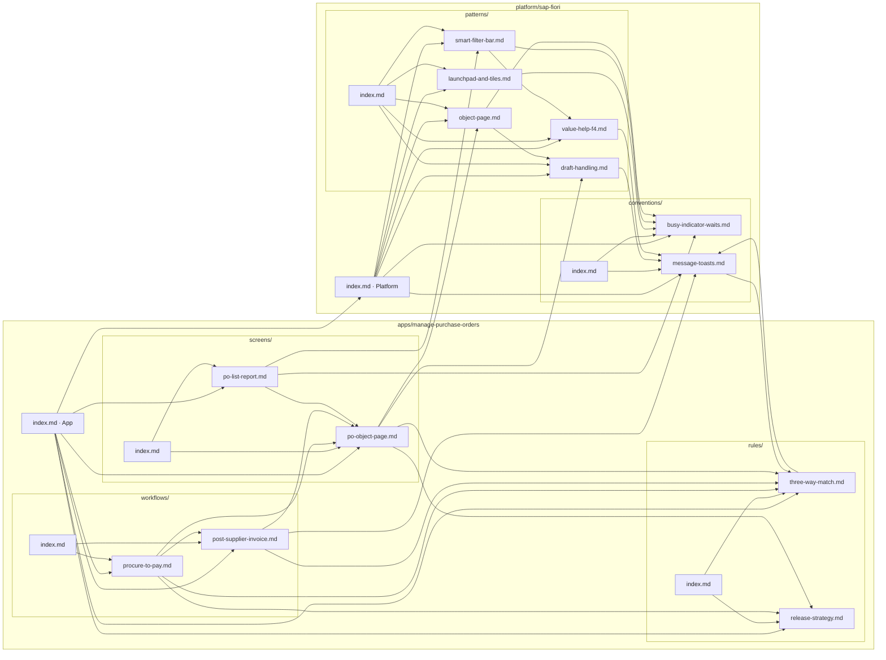

# Business Context (OKF bundles)

Human-authored, **ground-truth** domain knowledge the testing agents read _before_
they crawl a target app — so the Discoverer plans the real business workflows and
the Generator writes assertions against intended behaviour, not just "the page
loaded".

This is the **authored / trusted** counterpart to the **learned** knowledge in
`src/knowledge/` (which is distilled from past runs). Authored context is reference,
never evidence — it is not mutated by the distillation/promotion job.

Format follows the [Open Knowledge Format (OKF)](https://github.com/GoogleCloudPlatform/knowledge-catalog/tree/main/okf):
a directory of Markdown files with YAML frontmatter, where every folder has an
`index.md` and concepts cross-link with plain Markdown links.

## Layout

```
business-context/
├── platform/<product>/   # general handbook, reused by many apps (global scope)
└── apps/<app>/           # one specific app, keyed to a URL (app scope)
```

The `platform/` vs `apps/` split mirrors the global-vs-app scoping already used by
`PlaybookScope` in `src/knowledge`. The cross-links are the knowledge graph (the
`edges` of the authored layer).

## Concept graph

Subgraphs are folders (so this doubles as the filesystem view); every arrow is a
real Markdown link between concepts. Arrows that cross a subgraph border are the
**lateral** edges that make this a graph rather than a tree — `workflow → screen →
pattern`, `workflow → rule → convention`, and `app ⇄ platform`. Blue `index.md`
nodes are navigation entry points (progressive disclosure): they link out to their
children but are reached via the directory hierarchy.



## How a bundle is selected at run time

1. Normalize the target URL's origin (same as `appIdFor` / `normalizeOrigin`).
2. Find app bundles whose `applies_to.origin` matches; among them pick the one whose
   `applies_to.routes` is the **longest prefix match** against the URL's hash/path.
   (SAP Fiori / Infor host many apps under one origin, differentiated by route.)
3. Also load each platform bundle named in the app's `built_on:`.
4. No match → run cold (no business context), exactly like today.

## Required frontmatter

Only `type` is required by OKF. App index pages add `applies_to` (for routing) and
`built_on` (to pull in platform bundles). Use `status: active` + `version` to mark
the live bundle when more than one exists for the same scope.

## Authoring a new app bundle

Clone `apps/manage-purchase-orders/` as a template, update the `index.md`
frontmatter (`applies_to`, `built_on`), and fill in `workflows/`, `screens/`, and
`rules/` for your app.
