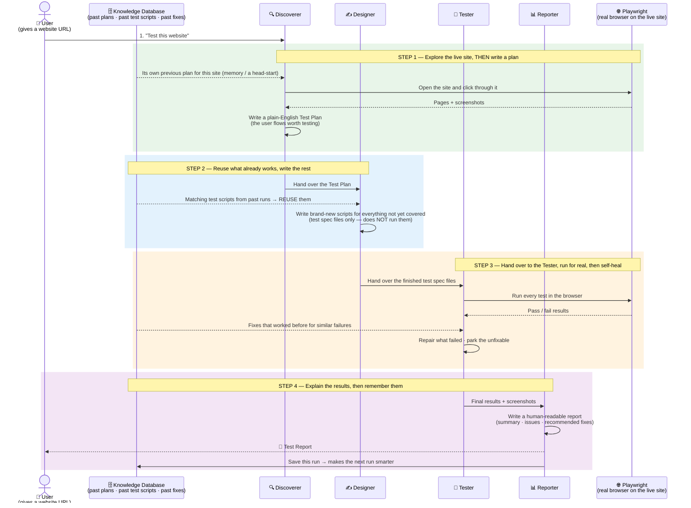

# How the AI Test-Suite Works — One-Page Overview

A board-level view of the four AI agents, what each one does, when they look at the
database, and where the real browser (Playwright) is driven.

## The five questions this answers

| Question                                                       | Answer                                                                                                                                                                                                                                                             |
| -------------------------------------------------------------- | ------------------------------------------------------------------------------------------------------------------------------------------------------------------------------------------------------------------------------------------------------------------ |
| **Does an agent plan first, or explore first?**                | The **Discoverer explores the live site first** (clicking through it and taking screenshots) and **writes the plan afterwards**. It is not fully blind — it gets its _own previous plan_ from the database as a head-start, but it always re-checks the real site. |
| **How do agents get past plans from the database?**            | The **Discoverer** asks the Knowledge Database for the most recent plan it wrote for the same site and uses it as memory.                                                                                                                                          |
| **How do agents get matching test scripts from the database?** | The **Designer** asks the database for past test scripts that match the new plan. Confident matches are **reused as-is**; only the gaps get newly written.                                                                                                         |
| **Where is Playwright (the real browser) used?**               | In **two places** — the **Discoverer** drives it to explore the site, and the **Tester** **runs** the tests in it and then repairs any failures.                                                                                                                  |
| **What does each agent do?**                                   | **Discoverer** → explore + plan · **Designer** → write the tests (reusing past ones) · **Tester** → run + fix · **Reporter** → explain + store for next time.                                                                                                     |

> The database is **optional**: with no database connected, the same four agents still
> run start-to-finish — they just run "cold," without the memory boost.
