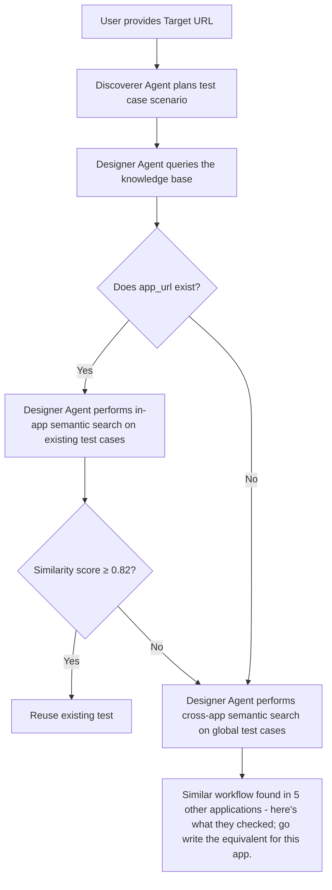

```mermaid
flowchart TD
    A[User provides Target URL]
    B[Discoverer Agent plans test case scenario]
    C[Designer Agent queries the knowledge base]
    D{Does app_url exist?}

    A --> B
    B --> C
    C --> D

    D -->|Yes| E[Designer Agent performs in-app semantic search on existing test cases]

    E --> F{Similarity score ≥ 0.82?}

    F -->|Yes| G[Reuse existing test]

    F -->|No| H[Designer Agent performs cross-app semantic search on global test cases]

    D -->|No| H

    H --> I["Similar workflow found in 5 other applications - here's what they checked; go write the equivalent for this app."]
```
