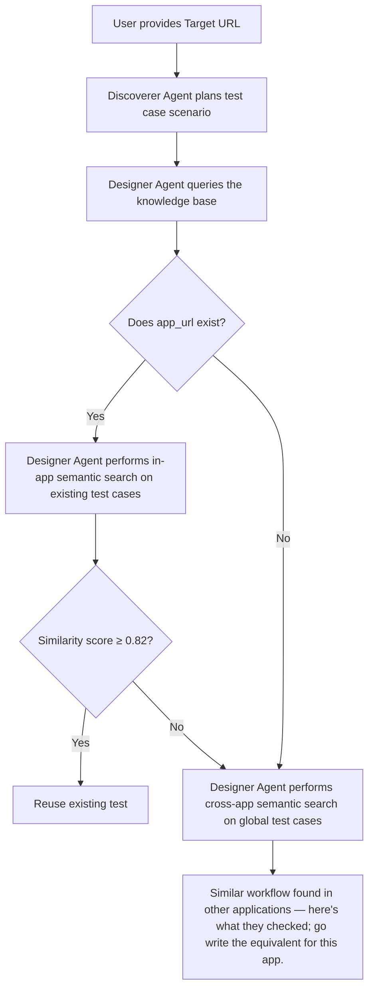
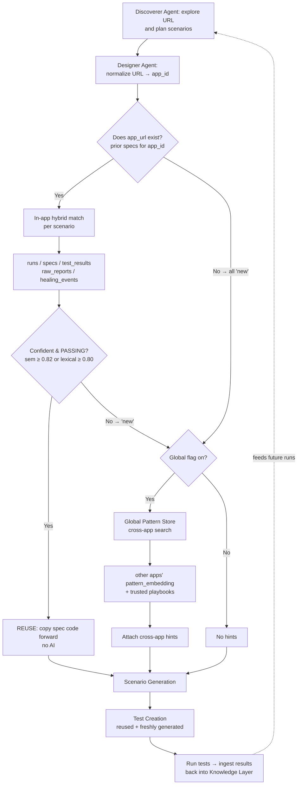
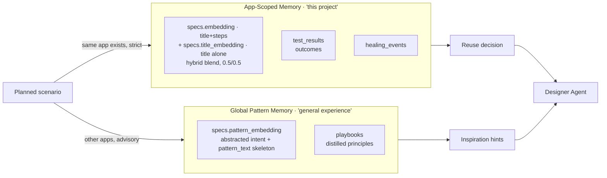
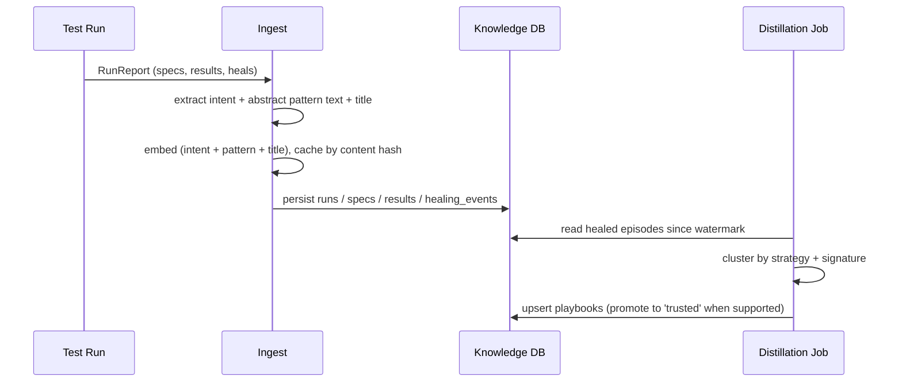

# Knowledge Retrieval Architecture — A Beginner's Guide

## The big idea in one paragraph

Every time we run our AI testing tool against a web app, it learns a few things:
which user workflows exist, what good tests for them look like, and how broken
tests got fixed. We save all of that in a PostgreSQL database we call the
"Knowledge Layer." So the next time we generate tests, the tool checks what it
already knows first. That way it can reuse a test it wrote last week instead of
writing it again, and it can borrow ideas from completely different apps that have
similar workflows. Two kinds of memory make this work:

| Memory type                  | What it's really asking                                   |
| ---------------------------- | --------------------------------------------------------- |
| **App‑Scoped Retrieval**     | "What do I already know about _this exact app_?"          |
| **Global Pattern Retrieval** | "How have _similar workflows on other apps_ been tested?" |

Think of it like an experienced QA engineer joining a project. App‑Scoped memory
is their notes from this specific project. Global Pattern memory is the years of
general experience they bring from every other project they've worked on.

---

## Table of contents

1. [How agents decide the retrieval scope](#1-how-agents-decide-the-retrieval-scope)
2. [App‑Scoped Retrieval](#2-app-scoped-retrieval)
3. [Global Pattern Retrieval](#3-global-pattern-retrieval)
4. [How retrieved knowledge helps agents](#4-how-retrieved-knowledge-helps-agents)
5. [Example walkthrough — SAP Transformation Incentive Calculator](#5-example-walkthrough--sap-transformation-incentive-calculator)
6. [PostgreSQL examples](#6-postgresql-examples)
7. [Comparison table](#7-comparison-table)
8. [Architecture diagrams](#8-architecture-diagrams)
9. [Folder structure](#9-folder-structure)
10. [Best practices](#10-best-practices)

---

## 1. How agents decide the retrieval scope

Two agents do the work here, and they use the knowledge base in different ways:

- The **Discoverer Agent** explores the target URL and plans the test scenarios.
  It doesn't decide what to reuse — but it does read the previous plan and the
  business context to get a head start. It still crawls the live site every time,
  and it's expected to update and extend that earlier plan, not just copy it.
- The **Designer Agent** takes those planned scenarios and asks the knowledge base
  the real question: for each scenario, should we **reuse** an existing test or
  **write a fresh one**?

People often assume the Designer picks _either_ App‑Scoped _or_ Global. It's
actually a sequence, and the first thing it checks is whether we've seen this app
before:



**Reading the gate:** Have we tested this app before? If yes, the knowledge base
already has tests saved for it, so we look there first. If no — it's a brand‑new
app and there's nothing of our own to reuse — so we skip that step and go straight
to looking at how other apps handled similar workflows. And for an app we already
know, we still only borrow from other apps for the scenarios we couldn't find a
good match for here.

> A couple of details the diagram leaves out: the `≥ 0.82` is the score for the
> _meaning_-based match. We also reuse a test if its words overlap strongly enough
> (a score of 0.80), and either way we only reuse a test that **passed** last time
> — more on both in §2. The cross‑app step also only runs when the
> `KNOWLEDGE_GLOBAL_PATTERNS=true` setting is turned on — more in §3.

### When do we use App‑Scoped retrieval?

Whenever the app is already in the knowledge base, and we try it first. This is the
careful, high‑trust tier, so we run it for every scenario of an app we know —
reusing a test that already passed is the cheapest and safest thing we can do. If
the app is brand‑new, there's nothing saved yet, so we skip this step.

### When do we use Global Pattern retrieval?

For the leftovers — any scenario we couldn't confidently match here, plus every
scenario when the app itself is brand‑new (since there's nothing of our own to
reuse). It only runs when the `KNOWLEDGE_GLOBAL_PATTERNS=true` setting is on, and
it never overrides a reuse — it just fills the gaps.

### What information drives the decision?

The decision is automatic and happens per scenario, based on:

| Signal                                                                               | Used for                                                     |
| ------------------------------------------------------------------------------------ | ------------------------------------------------------------ |
| **`app_id`** (the app's normalized origin, e.g. `https://sap-incentive.example.com`) | Restricting App‑Scoped search to this app only               |
| **Similarity score** between the planned scenario and existing specs                 | Deciding "confident match" vs "new"                          |
| **Last outcome** of the matched test (`passed` / `healed` / `failed`)                | Only a _passing_ test is reused; a failed one is regenerated |
| **The `KNOWLEDGE_GLOBAL_PATTERNS` flag**                                             | Whether the Global tier runs at all                          |

> 🔑 **The one rule to remember:** App‑Scoped reuse copies real test code forward,
> so it has to stay locked to the same app — that code contains selectors and URLs
> that only work there. Global Pattern retrieval never copies code; it only shares
> ideas, so it's safe to cross between apps.

---

## 2. App‑Scoped Retrieval

### What it does

It answers a simple question: _"Have I tested this workflow on this app before — and
can I just reuse that test?"_

### How the agent queries the knowledge database

When a run starts, the service (`PgKnowledgeService.assembleContext`) does three
things:

1. Work out the `app_id` by trimming the URL down to its origin
   (`https://sap-incentive.example.com/calc?x=1` → `https://sap-incentive.example.com`).
   That's why two different pages of the _same_ app share knowledge.
2. Load every test (spec) we originally wrote for that `app_id` — skipping copies
   (`readSpecsForApp`) — along with each one's key words, its embedding, and how it
   did the last time it ran.
3. For each planned scenario, score it against those tests and decide **reuse** or
   **new** (`decideForSpecs`).

### Where previous specs, runs, reports, and tests live

Everything hangs off `app_id`. Here are the real tables in our schema:

| Concept in this doc      | Real table                                                        | What it holds                                       |
| ------------------------ | ----------------------------------------------------------------- | --------------------------------------------------- |
| Test runs                | `runs`                                                            | One row per test run (time, URL, crawl mode)        |
| Test specs / **modules** | `specs`                                                           | Each generated Playwright test file + its embedding |
| Plan scenarios           | `plan_scenarios`                                                  | The titles the planner proposed for a run           |
| Execution reports        | `raw_reports` (full JSON) + `test_results` + `coverage_snapshots` | What happened when tests ran                        |
| Healing history          | `healing_events`                                                  | Every repair the self‑healing step made             |
| Flows                    | `flows`                                                           | Logical user‑workflow names for the app             |

### How existing tests get reused instead of rewritten

If a planned scenario confidently matches an existing test whose last run passed,
the agent copies that test's code forward exactly as it was — tagged with a
`// @kp-reused` marker — and skips the AI step entirely. No LLM call, and no chance
of getting a different result. If the match is weak, or the matched test failed
last time, we write the scenario fresh instead. We never quietly drop a scenario —
every planned flow ends up with a test.

### How this improves coverage over time

Because the agent remembers what's already covered, it spends its generation
budget on the gaps instead of rebuilding tests it already has. Over many runs that
pushes coverage up and keeps it steady (we even track a "knowledge‑reuse trend"
per app).

### How the matching actually works

We match in two ways and go with whichever is more confident:

1. **Word overlap** — `overlapCoefficient` over `significantTokens` (the meaningful
   words in the scenario title). It's simple and needs no AI. We reuse if this hits
   **0.80**.
2. **Meaning-based match (embeddings)** — we turn text into a list of **384 numbers**
   (an "embedding") using a local model (`Xenova/bge-small-en-v1.5`), and compare
   two pieces of text by how close their numbers are (cosine similarity). A pgvector
   **HNSW index** makes that search fast. The catch: the thing we search _with_ is
   always just a scenario **title** (`ScenarioInput.name`), so we keep **two**
   embeddings per test and blend them (migration 0005, weight
   `SEM_TITLE_WEIGHT = 0.5`):

   | Column                  | Embeds                             | Role in the blend                                             |
   | ----------------------- | ---------------------------------- | ------------------------------------------------------------- |
   | `specs.title_embedding` | the **title alone**                | `semTitle` — same shape as the query → exact title ≈ **1.0**  |
   | `specs.embedding`       | **title + numbered step comments** | `semIntent` — richer; keeps similar‑but‑different tests apart |

   ```
   sem = 0.5 · cos(query, title_embedding)  +  0.5 · cos(query, embedding)
   ```

   **Why blend the two, instead of just using `embedding`?** Comparing a bare title
   against an embedding built from a title _plus its steps_ tops out around **0.79**
   — just under the 0.82 bar — so an exact‑title match used to quietly never reuse.
   Adding the title‑only term fixes that (it lifts an exact match to about 0.90,
   clearing the bar), while the title+steps term still keeps two look‑alike but
   _different_ tests apart ("About scrolls" vs "Contact scrolls" stay around 0.77,
   below the bar). The reuse bar stays **0.82** (`SEM_REUSE`) on purpose — strict, so
   only a near‑certain match copies a test forward.

```
reuse  ⟺  ( lexical ≥ 0.80  OR  sem ≥ 0.82 )  AND  last run passed
new    ⟺  everything else
```

#### Two worked examples (with the numbers)

In both, the planned scenario is just a **title** (that's all the planner gives us),
and we score it against one stored, previously‑passing spec.

**Example 1 — same test → REUSE.**
The planner proposes **"Add item to cart"**, and we already have a passing spec
titled **"Add item to cart"** (whose `embedding` also folds in its step comments
like `// open product`, `// click add-to-cart`, `// assert badge = 1`).

| Signal                                       | How it's computed                                                              | Value     |
| -------------------------------------------- | ------------------------------------------------------------------------------ | --------- |
| Word overlap (lexical)                       | tokens `{add, item, cart}` vs `{add, item, cart}` → 3 shared ÷ 3 (smaller set) | **1.00**  |
| `semTitle` = cos(query, **title_embedding**) | query and the spec's title are the same text → near‑identical vectors          | **1.00**  |
| `semIntent` = cos(query, **embedding**)      | a bare title vs an embedding diluted by step comments — never quite lines up   | **0.79**  |
| `sem` (blend)                                | `0.5 × 1.00 + 0.5 × 0.79`                                                      | **0.895** |

Decision: lexical `1.00 ≥ 0.80` **and** `sem 0.895 ≥ 0.82`, last run passed → **REUSE**.
The point of the blend: on `semIntent` alone you'd score only **0.79** — _below_ 0.82
— and the semantic path would miss this obvious match. The `semTitle` term lifts it to
**0.90** so it clears the bar.

**Example 2 — look‑alike but different test → NEW.**
The planner proposes **"About page scrolls smoothly"**; the nearest stored spec is
**"Contact page scrolls smoothly"** (its steps assert different links/content).

| Signal                                       | How it's computed                                                                         | Value    |
| -------------------------------------------- | ----------------------------------------------------------------------------------------- | -------- |
| Word overlap (lexical)                       | `{about, page, scrolls, smoothly}` vs `{contact, page, scrolls, smoothly}` → 3 shared ÷ 4 | **0.75** |
| `semTitle` = cos(query, **title_embedding**) | titles differ by one word, so the vectors are close but not equal                         | **0.80** |
| `semIntent` = cos(query, **embedding**)      | the step comments differ (About vs Contact content), pulling them further apart           | **0.74** |
| `sem` (blend)                                | `0.5 × 0.80 + 0.5 × 0.74`                                                                 | **0.77** |

Decision: lexical `0.75 < 0.80` **and** `sem 0.77 < 0.82` → **NEW** (generate a fresh
test). Here the `semIntent` term does the opposite job — the differing _steps_ drag the
blend below the bar, so two pages that merely sound alike don't get one test reused for
the other.

> **It fails gracefully.** If embeddings are turned off or the model errors out, the
> meaning score is just `0` and we fall back to word overlap — same code path, no
> crash. And a test with **no `title_embedding`** yet (ingested before 0005, or not
> backfilled) simply uses its `embedding` for both halves of the blend, which gives
> exactly the old pre‑0005 number — again, no error.

---

## 3. Global Pattern Retrieval

### What it does

It answers: _"This workflow is brand‑new for this app — but how have similar
workflows on completely different apps been tested?"_ In other words, it carries
testing know‑how between unrelated applications.

### How the system spots patterns across apps

Every app's tests get a second, special embedding called the **pattern embedding**
(`specs.pattern_embedding`). Before we build it, we strip out the app‑specific
details — product names, prices, URLs, numbers:

```
"Add 'SAP Integration Suite' to comparison"   ─abstract→   "add to comparison"
"Add 'Acme Pro Plan' to cart"                  ─abstract→   "add to cart"
"Checkout with card ending 4242"               ─abstract→   "checkout with card ending"
```

That makes the embedding capture the _shape_ of the workflow rather than the exact
words, so the same workflow on two different apps lands in the same place.

### How we find reusable patterns

Two things work together:

1. **Searching the pattern collection** — we abstract the planned scenario the same
   way, embed it, and find the closest passing patterns on _other_ apps
   (`findGlobalPatternSpecs`, a cross‑app HNSW search).
2. **Distilled Playbooks** (`playbooks` table) — the closest thing we have to a
   written pattern library. A background "distillation" job studies repairs that
   keep happening and writes down reusable rules of thumb (e.g. "prefer role‑based
   locators over brittle CSS"). Only rules with enough evidence behind them get
   marked `trusted` and added to prompts. Playbooks can apply everywhere
   (**global**), to one **app**, or to one **componentType**.

### How agents recognize similar workflows

By finding the nearest neighbors in that abstracted space. "Fill in migration inputs
and calculate savings" on a SAP app sits right next to "fill in loan inputs and
calculate interest" on a banking app — different worlds, same _fill in a form →
compute → show the result_ shape.

### How past patterns help write new scenarios

We hand the single best match to the Designer agent as an example to learn from
("here's how this kind of workflow was tested elsewhere — adapt it to this app's
screen"). Each hint comes with an **abstracted workflow skeleton**
(`PatternHint.workflow`) — the matched test's title and steps with the
app‑specific bits removed, trimmed to at most 240 characters
(`PATTERN_WORKFLOW_MAXLEN`) so a long test can't flood the prompt and no foreign
selectors or URLs sneak in. The agent still writes a fresh test against the current
app; it just starts from a better idea, which lifts coverage and surfaces edge
cases it might not have thought of.

### The pattern‑recognition algorithms (Global)

| Algorithm                                   | Where we use it                                                                                                                                                                  |
| ------------------------------------------- | -------------------------------------------------------------------------------------------------------------------------------------------------------------------------------- |
| **Abstraction + embedding‑based retrieval** | Strip entities → embed → represent workflow shape                                                                                                                                |
| **Nearest‑neighbor search (cosine + HNSW)** | `findGlobalPatternSpecs` ranks passing patterns on other apps; `selectGlobalPatterns` keeps the single top match per scenario (`PATTERN_K = 1`)                                  |
| **Clustering**                              | The distillation job (`clusterEpisodes`) groups recurring repair episodes by strategy + signature similarity (single‑link, threshold 0.60) so each cluster becomes one principle |
| **Pattern library**                         | The `playbooks` table — distilled, evidence‑linked, trust‑gated principles                                                                                                       |

**The guardrails on this tier:**

- **Passing tests only** — we never copy an idea from a test that failed.
- **A relevance floor of 0.70** (`PATTERN_RELEVANCE`) — looser than App‑Scoped's
  0.82, because "is this a relevant example?" is an easier question than "is this the
  same test?".
- **One hint per scenario (`PATTERN_K = 1`), 8 in total (`PATTERN_BUDGET`)** — only
  the single best match above the floor goes to each new scenario, which keeps the
  prompt focused.
- **Skeletons, not code** — each hint is trimmed to a short abstracted workflow
  (`PATTERN_WORKFLOW_MAXLEN`, 240 chars), never raw code from another app.
- **Advice only** — hints are read, never run; the decision stays "new".

---

## 4. How retrieved knowledge helps agents

| Agent activity                 | How knowledge helps                                                                                                                                                                                                                                                                    |
| ------------------------------ | -------------------------------------------------------------------------------------------------------------------------------------------------------------------------------------------------------------------------------------------------------------------------------------- |
| **Scenario generation**        | The planner sees what's already covered (App‑Scoped) and what similar apps tested (Global), so it proposes a more complete, less redundant scenario list.                                                                                                                              |
| **Test case creation**         | Confident App‑Scoped matches are **copied forward** (no AI, deterministic). New ones are generated _with_ Global pattern hints as examples.                                                                                                                                            |
| **Edge‑case discovery**        | Global patterns surface validations other apps already learned to test (boundary values, empty inputs, error states) that this app's history hasn't covered yet.                                                                                                                       |
| **Avoiding duplicate tests**   | App‑Scoped reuse means a workflow tested last week isn't re‑generated this week. Within a run, Global hints are de‑duplicated by `(source app, title)`.                                                                                                                                |
| **Module reuse**               | A whole spec file (a "module") is reused verbatim when its workflow confidently matches a passing prior spec.                                                                                                                                                                          |
| **Healing & self‑improvement** | When a test breaks, the healer looks up **precedents** — past successful repairs of similar failures (`healing_events`, matched by failure‑signature embedding) — and applies the same fix strategy. Distilled playbooks then spread the best repair lessons to all future generation. |

---

## 5. Example walkthrough — SAP Transformation Incentive Calculator

**Application:** SAP Transformation Incentive Calculator
**`app_id`:** `https://sap-incentive.example.com`

**Workflow under test:**

1. Select **"Calculate TCO"**
2. Choose **SAP Integration Suite**
3. Fill **migration input fields**
4. **Calculate projected savings**

Let's assume we've tested this app before, so there's some history to draw on.

### The flow

```
New URL submitted
   │
   ▼
① Agent explores the app  ──────────────► discovers pages, forms, the "Calculate TCO" flow
   │
   ▼
② App‑Scoped knowledge lookup  ─────────► reads runs/specs/results for app_id = sap-incentive
   │                                       "Select Calculate TCO"      → 0.94 match, last PASSED  ✅ REUSE
   │                                       "Choose SAP Integration Suite" → 0.88 match, PASSED   ✅ REUSE
   │                                       "Fill migration input fields"  → 0.40 match           ❌ NEW
   │                                       "Calculate projected savings (negative input)" → none ❌ NEW
   ▼
③ Existing tests reused  ───────────────► 2 spec files copied forward verbatim (no AI, instant)
   │
   ▼
④ Global patterns loaded (for the 2 "new" scenarios — single best match each)
   │   "fill migration input fields" ─abstract→ "fill input fields"
   │        → top passing pattern on another app: a loan calculator's
   │          "fill application inputs" (workflow skeleton, ≤240 chars)
   │   "calculate projected savings (negative input)" ─abstract→ "calculate result negative input"
   │        → top pattern: a tax app's "compute total with negative/zero boundary values"
   ▼
⑤ Additional scenarios generated  ──────► designer writes fresh tests for the 2 gaps,
   │                                       inspired by those cross‑app patterns
   │                                       (+ adds a boundary/edge case it learned from them)
   ▼
⑥ Final test suite produced  ───────────► 2 reused + 2 newly generated = complete, non‑redundant
```

### Which knowledge came from where?

| Output                                          | Source                          | Why                                                                     |
| ----------------------------------------------- | ------------------------------- | ----------------------------------------------------------------------- |
| "Select Calculate TCO" test                     | **App‑Scoped**                  | Exact passing test already existed for _this_ app → copied forward      |
| "Choose SAP Integration Suite" test             | **App‑Scoped**                  | Same — high‑confidence reuse                                            |
| Structure of the "Fill migration inputs" test   | **Global Pattern**              | No prior test here, but other apps' form‑fill patterns showed the shape |
| The extra **negative/zero boundary** edge case  | **Global Pattern**              | A tax app had already learned to test numeric boundaries                |
| Selectors / actual field names in the new tests | **Neither (freshly generated)** | These are specific to _this_ app's DOM and must be written against it   |

### Why we need both

- **App‑Scoped on its own** would reuse the 2 known tests but write the 2 new ones
  from scratch, missing edge cases other apps already found.
- **Global on its own** would give generic inspiration but waste effort rewriting
  the 2 workflows we already have perfectly good tests for — and risk pulling in
  another app's selectors.
- **Together:** maximum reuse (cheap and safe) plus maximum learning (broad
  coverage).

---

## 6. PostgreSQL examples

> In all the queries below, `:app_id = 'https://sap-incentive.example.com'`. Where
> you see `:query_vec`, that's a **384‑number vector** the embedder builds in code
> (you never write vectors by hand). `<=>` is pgvector's **cosine distance**, and
> `1 - (a <=> b)` turns that into a **similarity** score.

### App‑Scoped Retrieval

**(a) Find previous runs for this application** — table `runs`

```sql
SELECT run_id, url, status, crawl_mode, created_at
  FROM runs
 WHERE app_id = :app_id
 ORDER BY created_at DESC;
```

_Returns:_ every past test run for this app, newest first — the app's history.

**(b) Load existing specs (test modules) with their last outcome** — tables `specs` + `test_results`

```sql
SELECT s.run_id, s.file, s.title, s.flow_id, s.tokens,
       (SELECT tr.outcome
          FROM test_results tr
         WHERE tr.run_id = s.run_id AND tr.file = s.file
         LIMIT 1) AS last_outcome
  FROM specs s
 WHERE s.app_id = :app_id
   AND s.reused = false           -- only originally‑generated specs, not copies
 ORDER BY s.created_at DESC;
```

_Returns:_ the reusable test modules for this app, and whether each one passed last
time. This is exactly what `readSpecsForApp` loads before deciding reuse vs new.

**(c) Find the most similar existing test to a planned scenario (hybrid semantic)** — `specs.title_embedding` + `specs.embedding`

Here `:query_vec` is the embedding of the **bare scenario title**. We blend the
title‑only score with the title+steps score (`SEM_TITLE_WEIGHT = 0.5`), and fall
back to `embedding` when a test has no `title_embedding`:

```sql
SELECT s.file, s.title,
       0.5 * (1 - (COALESCE(s.title_embedding, s.embedding) <=> :query_vec))   -- semTitle
     + 0.5 * (1 - (s.embedding <=> :query_vec))                                -- semIntent
         AS similarity
  FROM specs s
 WHERE s.app_id = :app_id
   AND s.reused = false
   AND s.embedding IS NOT NULL
 ORDER BY similarity DESC                  -- HNSW accelerates each term's nearest‑neighbor read
 LIMIT 5;
```

_Returns:_ the 5 closest prior tests. If the top blended score is 0.82 or higher
**and** that test passed last time, the agent reuses it. (This mirrors `hybridSem`
in `coverageDecision.ts`; in production the blend is computed in app code over the
candidate set, not in one SQL pass.)

**(d) Load historical reports** — table `raw_reports`

```sql
SELECT run_id, report->>'generatedAt' AS generated_at,
       report->'coverage'->>'percent' AS coverage_percent
  FROM raw_reports
 WHERE app_id = :app_id
 ORDER BY created_at DESC
 LIMIT 10;
```

_Returns:_ the full run reports (stored as JSON). These are the source of truth we
use to rebuild knowledge and to grab a test's full source code when copying it
forward.

**(e) Find healed / fixed tests** — table `healing_events`

```sql
SELECT flow_id, file, failure_signature, strategy,
       before_snippet, after_snippet, created_at
  FROM healing_events
 WHERE app_id = :app_id
   AND outcome = 'healed'
 ORDER BY created_at DESC;
```

_Returns:_ every successful self‑repair for this app — which we use to suggest
sturdier locators and to seed healing precedents.

### Global Pattern Retrieval

> These look across **every app except the current one**, only at tests that
> **passed**, matching on the abstracted `pattern_embedding`.

**(a) Find form‑fill / validation patterns from other apps**

```sql
SELECT s.app_id, s.title,
       1 - (s.pattern_embedding <=> :query_vec) AS similarity
  FROM specs s
 WHERE s.app_id <> :app_id                       -- other apps only
   AND s.reused = false
   AND s.pattern_embedding IS NOT NULL
   AND EXISTS (                                   -- passing only
         SELECT 1 FROM test_results tr
          WHERE tr.run_id = s.run_id AND tr.file = s.file
            AND tr.outcome IN ('passed','healed'))
 ORDER BY s.pattern_embedding <=> :query_vec
 LIMIT 3;
```

_Returns:_ the 3 closest passing form‑fill tests from other apps. With `:query_vec`
= embedding of `"fill input fields"`, this surfaces the loan‑app and invoice‑app
form patterns from the walkthrough. (This is exactly `findGlobalPatternSpecs`.)

**(b) Find common numeric boundary test patterns**
Same shape — only the meaning of `:query_vec` changes (embedding of
`"calculate result boundary value"`):

```sql
SELECT s.app_id, s.title, 1 - (s.pattern_embedding <=> :query_vec) AS similarity
  FROM specs s
 WHERE s.app_id <> :app_id AND s.reused = false AND s.pattern_embedding IS NOT NULL
   AND EXISTS (SELECT 1 FROM test_results tr
                WHERE tr.run_id = s.run_id AND tr.file = s.file
                  AND tr.outcome IN ('passed','healed'))
 ORDER BY s.pattern_embedding <=> :query_vec
 LIMIT 3;
```

_Returns:_ passing tests from other apps that exercise numeric boundaries
(negative/zero/max), e.g. the tax app's boundary test.

**(c) Find calculation‑workflow patterns** — same query, with `:query_vec` =
embedding of `"calculate projected savings"`. _Returns:_ "input → compute → show
result" tests across apps.

**(d) Find reusable scenario templates (distilled principles)** — table `playbooks`

```sql
SELECT principle, antipattern, recommendation, support_count, confidence
  FROM playbooks
 WHERE status = 'trusted'
   AND scope_kind IN ('global','componentType')   -- cross‑app reusable
 ORDER BY support_count DESC, confidence DESC;
```

_Returns:_ the trusted, evidence‑backed rules of thumb that apply beyond a single
app — our explicit pattern library. (`getPlaybooks` / `trustedPlaybooks` load these
and add them to prompts.)

---

## 7. Comparison table

| Category              | App‑Scoped Retrieval                                                                                | Global Pattern Retrieval                                                                                           |
| --------------------- | --------------------------------------------------------------------------------------------------- | ------------------------------------------------------------------------------------------------------------------ |
| **Purpose**           | Reuse the _exact_ tests already written for _this_ app                                              | Borrow _testing ideas_ from similar workflows on _other_ apps                                                      |
| **Search scope**      | One app only (`WHERE app_id = :app_id`)                                                             | All apps except the current one (`WHERE app_id <> :app_id`)                                                        |
| **Knowledge source**  | This app's `specs`, `runs`, `test_results`, `raw_reports`, `healing_events`                         | Other apps' abstracted `specs.pattern_embedding` + `playbooks`                                                     |
| **Algorithm used**    | Hybrid: lexical token overlap **OR** blended semantic cosine — `0.5·title + 0.5·title+steps` (HNSW) | Abstraction → embedding → cross‑app nearest‑neighbor (HNSW); clustering for playbooks                              |
| **Data stored**       | `embedding` (title + steps) **+** `title_embedding` (title alone) + tokens + outcomes               | Abstracted `pattern_embedding` (entities stripped) + `pattern_text` skeleton + distilled principles                |
| **Reusability**       | Whole test files copied forward **verbatim** (code reused)                                          | Only _patterns/ideas_ reused — never code                                                                          |
| **Precision**         | Very high — strict 0.82 threshold + must have passed                                                | Looser — 0.70 relevance floor, single top match per scenario (`PATTERN_K = 1`)                                     |
| **Generalization**    | None — tied to one app's DOM                                                                        | High — transfers across domains and apps                                                                           |
| **Example use cases** | "I tested 'Calculate TCO' last week → reuse it"                                                     | "This form is new here, but 5 other apps tested forms like it"                                                     |
| **Benefits**          | Fast, deterministic, zero‑cost reuse; rising coverage per app                                       | Cold‑start help, broader edge‑case coverage, knowledge transfer                                                    |
| **Limitations**       | Empty for a brand‑new app (nothing to reuse yet)                                                    | Advisory only; quality depends on pool size; behind a feature flag; needs backfill to include pre‑existing history |

---

## 8. Architecture diagrams

### High‑level retrieval flow



### The two stores side by side



### Knowledge lifecycle (how memory grows)



---

## 9. Folder structure

This mirrors the real layout under `src/knowledge/` — a clean split between
_storing_, _retrieving_, and _learning_:

```
src/knowledge/
├── index.ts                  # Public entry: KnowledgeService (the only thing callers use)
├── types.ts                  # All shared contracts (ScenarioInput, ContextPack, Playbook…)
├── appId.ts                  # URL → normalized origin (the app_id)
├── constants.ts              # REUSE_MARKER and friends
├── safety.ts                 # withKb(): every DB op degrades safely, never throws
│
├── store/                    # ── HOW knowledge is stored ──
│   ├── db.ts                 # pgvector connection pool
│   ├── migrate.ts            # Applies *.sql migrations in order
│   ├── repo.ts               # ALL SQL lives here (the only file with queries)
│   └── migrations/
│       ├── 0001_init.sql            # apps, runs, specs, results, reports…
│       ├── 0002_pgvector.sql        # specs.embedding + HNSW (App‑Scoped semantic)
│       ├── 0003_healing_playbooks.sql  # healing_events, playbooks
│       ├── 0004_pattern_embedding.sql  # specs.pattern_embedding (Global tier)
│       └── 0005_title_embedding.sql    # specs.title_embedding (hybrid App‑Scoped reuse)
│
├── embeddings/               # ── Turning text into vectors ──
│   ├── embed.ts              # Local model + cosine similarity
│   └── abstractIntent.ts     # Strip app‑specific entities → workflow shape
│
├── ingest/                   # ── WRITING new knowledge after a run ──
│   ├── extract.ts            # RunReport → structured rows + intent/pattern/title text
│   └── ingestRun.ts          # Embed + persist (idempotent by run_id)
│
├── retrieve/                 # ── READING knowledge to help generation ──
│   ├── coverageDecision.ts   # App‑Scoped reuse|new decision (hybrid match)
│   ├── globalPatterns.ts     # Global cross‑app pattern hints
│   ├── appProfile.ts         # What we know about an app (coverage map)
│   └── healingPrecedents.ts  # Past repairs for a similar failure
│
├── distill/                  # ── LEARNING general principles over time ──
│   ├── cluster.ts            # Group recurring heals into coherent clusters
│   ├── summarize.ts          # Cluster → principle (LLM, off the hot path)
│   ├── promote.ts            # Promote well‑supported principles to 'trusted'
│   └── run.ts                # The incremental distillation job
│
└── heal/                     # ── Self‑healing support ──
    ├── signature.ts          # Normalize a failure into a stable signature
    ├── strategy.ts           # Classify the repair strategy
    └── provenance.ts         # Track template‑directed vs blind repairs
```

**An easy way to picture it:** `store/` is the filing cabinet, `ingest/` files
things away, `retrieve/` pulls the right folder when you ask, and `distill/` is the
librarian who every so often writes "best‑practice" summary cards from everything
on file.

---

## 10. Best practices

### When to write a _new_ test (instead of reusing one)

- The scenario is genuinely new to this app (App‑Scoped found no confident match) →
  write it, ideally with Global hints to guide it.
- A test that used to match **failed last time** → write it again; don't reuse a
  broken test.
- A **playbook** (distilled principle) is only ever created by the background
  distillation job, and only once it has **enough independent evidence** across runs
  — never written by hand on the spot. That's what keeps the pattern library
  trustworthy.

### When to reuse an existing module

- The scenario **confidently matches** a prior test (word overlap ≥ 0.80 **or**
  meaning score ≥ 0.82) **whose last run passed**. Reuse is the default here — it's
  free, repeatable, and safe — so prefer it whenever the bar is met.

### How to avoid duplicate knowledge

- **Ingest is idempotent:** writes are keyed by `run_id` (delete‑then‑insert), so
  re‑ingesting the same run never duplicates rows.
- **Embeddings are cached by content hash:** an unchanged test is never re‑embedded.
- **Copies are tracked:** copied‑forward tests are flagged `reused = true` and left
  out of future reuse and pattern searches, so a copy never poses as a fresh
  original.
- **Hints are de‑duplicated within a run:** Global hints are merged by
  `(source app, title)`, keeping only the best‑scoring one.
- **Don't add parallel tables:** all SQL goes through `store/repo.ts`; reuse the
  existing tables and the `app_id` convention.

### How knowledge grows over time

- **Every run teaches the system.** New tests, outcomes, and repairs get ingested,
  so the App‑Scoped store grows and coverage trends up.
- **Repairs feed learning.** Fixes become `healing_events`; the distillation job
  groups them and promotes the durable lessons into `trusted` playbooks that improve
  _all_ future generation (we track the share of repairs guided by a prior template
  — when that number rises, the memory is doing its job).
- **Patterns get sharper as the pool grows.** The more apps in the database, the
  better Global Pattern retrieval gets — so when you turn the Global tier on, it's
  worth **backfilling** `pattern_embedding` for older tests
  (`npm run knowledge:pattern-backfill`) so the benefit isn't limited to brand‑new
  runs.
- **Backfill the title embedding after migration 0005.** Tests ingested before 0005
  have no `title_embedding`, so reuse falls back to `embedding` for both halves of
  the blend — which caps exact‑title scenarios around 0.79 (under 0.82) and quietly
  suppresses reuse. Run `npm run knowledge:title-backfill` to re‑embed the stored
  titles in place (it's idempotent, reads `specs.title`, and needs no
  `raw_reports`).
- **The thresholds are tuned, not guessed.** The reuse bar (0.82, `SEM_REUSE`) and
  the title/intent blend weight (`SEM_TITLE_WEIGHT = 0.5`) were calibrated against a
  labeled set (`npm run knowledge:calibrate`); if you swap the embedding model or
  change the abstraction rules, re‑calibrate.

---

### TL;DR for a new contributor

- **App‑Scoped = "reuse my own past tests for this app."** Strict, code‑level, very
  precise, always tried first.
- **Global Pattern = "borrow ideas from how other apps tested similar workflows."**
  Abstracted, advisory, broad, used for the gaps.
- Both write back into PostgreSQL after every run, so the system **gets smarter the
  more you use it**.
