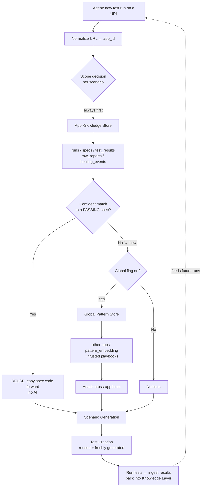
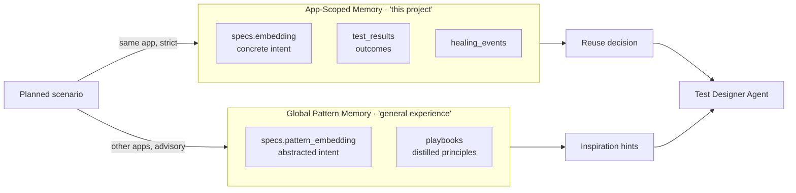
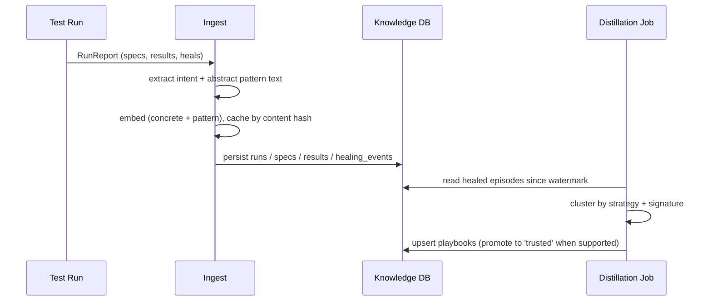

# Knowledge Retrieval Architecture — A Beginner's Guide

> **Who is this for?** New contributors (technical _and_ non-technical) who want to
> understand how our test‑generation agents remember what they've done before and
> reuse that knowledge to write better tests, faster.

---

## The big idea in one paragraph

Every time we run our AI testing tool against a web app, it learns something:
which user workflows exist, what good tests for them look like, and how broken
tests got repaired. We **save** that learning in a PostgreSQL database (the
"Knowledge Layer"). The next time an agent generates tests, it first **asks the
database what it already knows** — so it can _reuse_ a test it wrote last week
instead of writing it again, and _borrow patterns_ from completely different apps
that have similar workflows. Two kinds of memory power this:

| Memory type                  | Plain-English meaning                                     |
| ---------------------------- | --------------------------------------------------------- |
| **App‑Scoped Retrieval**     | "What do I already know about _this exact app_?"          |
| **Global Pattern Retrieval** | "How have _similar workflows on other apps_ been tested?" |

Think of it like an experienced QA engineer joining a project. App‑Scoped memory
is **their notes from this specific project**. Global Pattern memory is **their
years of general experience** from every other project they've worked on.

---

## Table of contents

1. [How agents decide the retrieval scope](#1-how-agents-decide-the-retrieval-scope)
2. [App‑Scoped Retrieval](#2-app-scoped-retrieval)
3. [Global Pattern Retrieval](#3-global-pattern-retrieval)
4. [How retrieved knowledge helps agents](#4-how-retrieved-knowledge-helps-agents)
5. [Example walkthrough — SAP Transformation Incentive Calculator](#5-example-walkthrough--sap-transformation-incentive-calculator)
6. [PostgreSQL examples](#6-postgresql-examples)
7. [Comparison table](#7-comparison-table)
8. [Architecture diagrams](#8-architecture-diagrams)
9. [Folder structure](#9-folder-structure)
10. [Best practices](#10-best-practices)

---

## 1. How agents decide the retrieval scope

A common misconception is that the agent picks _either_ App‑Scoped _or_ Global.
In reality it's a **cascade** — the two tiers run one after another, and each
scenario flows through both:

```
For each planned test scenario:
  STEP 1 (always):  App‑Scoped  → "Do I already have a passing test for this on THIS app?"
                                     ├─ YES, confident → REUSE the old test (copy it, no AI needed)
                                     └─ NO            → mark scenario as "new" (must generate)

  STEP 2 (for "new" scenarios only, if enabled):
                    Global Pattern → "How was a similar workflow tested on OTHER apps?"
                                     → attach those as hints to inspire generation
```

### When does it choose App‑Scoped retrieval?

**Always, first.** App‑Scoped is the high‑precision, high‑trust tier. It is tried
for _every_ scenario because reusing an exact, previously‑passing test is the
cheapest and safest outcome.

### When does it choose Global Pattern retrieval?

**Only for the leftovers** — scenarios that App‑Scoped could _not_ confidently
match (the "new" ones), and only when the feature flag
`KNOWLEDGE_GLOBAL_PATTERNS=true` is set. It never _replaces_ an App‑Scoped reuse;
it only helps with the gaps.

### What information drives the decision?

The decision is **automatic and per‑scenario**, based on:

| Signal                                                                               | Used for                                                     |
| ------------------------------------------------------------------------------------ | ------------------------------------------------------------ |
| **`app_id`** (the app's normalized origin, e.g. `https://sap-incentive.example.com`) | Restricting App‑Scoped search to this app only               |
| **Similarity score** between the planned scenario and existing specs                 | Deciding "confident match" vs "new"                          |
| **Last outcome** of the matched test (`passed` / `healed` / `failed`)                | Only a _passing_ test is reused; a failed one is regenerated |
| **The `KNOWLEDGE_GLOBAL_PATTERNS` flag**                                             | Whether the Global tier runs at all                          |

> 🔑 **Key invariant:** App‑Scoped reuse copies _real test code_ forward, so it
> must stay locked to the same app — that code contains selectors and URLs that
> only work on that app. Global Pattern retrieval never copies code; it only
> shares _ideas_, so it's safe to cross app boundaries.

---

## 2. App‑Scoped Retrieval

### What it does

Answers: _"For this specific app, have I tested this workflow before — and can I
just reuse that test?"_

### How the agent queries the knowledge database

When a run starts, the service (`PgKnowledgeService.assembleContext`) does this:

1. Compute the `app_id` by **normalizing the URL to its origin**
   (`https://sap-incentive.example.com/calc?x=1` → `https://sap-incentive.example.com`).
   This is why two different pages of the _same_ app share knowledge.
2. Load every previously generated, **non‑reused** spec for that `app_id`
   (`readSpecsForApp`), each with its lexical tokens, its embedding, and the
   outcome of the last time it ran.
3. For each planned scenario, score it against those specs and decide **reuse** or
   **new** (`decideForSpecs`).

### How previous specs, runs, reports, and tests are discovered

Everything hangs off `app_id`. The relevant tables (real names in our schema):

| Concept in this doc      | Real table                                                        | What it holds                                       |
| ------------------------ | ----------------------------------------------------------------- | --------------------------------------------------- |
| Test runs                | `runs`                                                            | One row per test run (time, URL, crawl mode)        |
| Test specs / **modules** | `specs`                                                           | Each generated Playwright test file + its embedding |
| Plan scenarios           | `plan_scenarios`                                                  | The titles the planner proposed for a run           |
| Execution reports        | `raw_reports` (full JSON) + `test_results` + `coverage_snapshots` | What happened when tests ran                        |
| Healing history          | `healing_events`                                                  | Every repair the self‑healing step made             |
| Flows                    | `flows`                                                           | Logical user‑workflow names for the app             |

### How existing tests are reused instead of recreated

If a planned scenario **confidently matches** an existing spec **whose last run
passed**, the agent **copies that spec's source code forward verbatim** — tagged
with a `// @kp-reused` marker — and skips the AI generation entirely. No LLM call,
no risk of a different result. If the match is weak, or the matched test last
_failed_, the scenario is regenerated from scratch (we never silently skip a
scenario — every planned flow ends with a test).

### How app‑specific knowledge improves coverage

Because the agent remembers what's already covered, it spends its generation
budget on the **gaps** instead of re‑deriving tests it already has. Over many
runs this pushes coverage up and keeps it stable (we even track a
"knowledge‑reuse trend" per app).

### The retrieval algorithms (App‑Scoped)

We use **hybrid retrieval** — two scoring methods, and the _stronger_ one wins:

1. **Lexical / metadata filtering** — `overlapCoefficient` over
   `significantTokens` (the meaningful words in the scenario title). Robust, no AI
   needed. Threshold to reuse: **0.80**.
2. **Semantic similarity search (embeddings + vector search)** — each spec's
   _intent text_ (title + numbered step comments) is converted to a **384‑dimension
   embedding** by a local model (`Xenova/bge-small-en-v1.5`, mean‑pooled,
   L2‑normalized). Similarity is **cosine similarity**, accelerated by a pgvector
   **HNSW index**. Threshold to reuse: **0.82** (deliberately strict — only a
   near‑certain match copies a test forward).

```
reuse  ⟺  ( lexical ≥ 0.80  OR  semantic ≥ 0.82 )  AND  last run passed
new    ⟺  everything else
```

> **Graceful degradation:** if embeddings are turned off or the model fails, the
> semantic score is simply `0`, and the system falls back to lexical‑only — same
> code path, never an error.

---

## 3. Global Pattern Retrieval

### What it does

Answers: _"This is a brand‑new workflow for this app — but how have **similar
workflows on completely different apps** been tested?"_ It transfers _testing
know‑how_ between unrelated applications.

### How the system learns common patterns across applications

Every app's tests are stored with a second, special embedding called the
**pattern embedding** (`specs.pattern_embedding`). Before embedding, the test's
intent is **abstracted** — app‑specific details (product names, prices, URLs,
numbers) are stripped out:

```
"Add 'SAP Integration Suite' to comparison"   ─abstract→   "add to comparison"
"Add 'Acme Pro Plan' to cart"                  ─abstract→   "add to cart"
"Checkout with card ending 4242"               ─abstract→   "checkout with card ending"
```

This makes the embedding capture the **workflow shape**, not the vocabulary, so
the same workflow on two different apps lands in the same place in vector space.

### How reusable validation patterns are discovered

Two mechanisms work together:

1. **Embedding‑based retrieval over the pattern corpus** — the planned scenario is
   abstracted the same way, embedded, and used to find the **nearest passing
   patterns on _other_ apps** (`findGlobalPatternSpecs`, a cross‑app HNSW search).
2. **Distilled Playbooks** (`playbooks` table) — our closest thing to an explicit
   **pattern library**. A background "distillation" job studies recurring repairs
   and writes down reusable _principles_ (e.g. "prefer role‑based locators over
   brittle CSS"). Only principles backed by enough evidence are promoted to
   `trusted` and injected into prompts. Playbooks can be **global** (apply
   everywhere), **app**‑specific, or **componentType**‑specific.

### How agents recognize similar workflows

By **nearest‑neighbor search** in the abstracted embedding space. "Fill in
migration inputs and calculate savings" on a SAP app sits near "fill in loan
inputs and calculate interest" on a banking app — different domains, same
_form → compute → show result_ shape.

### How historical patterns help generate new scenarios

The matched patterns are passed to the test‑designer agent as **few‑shot
inspiration** ("here's how this kind of workflow was tested elsewhere — adapt it
to _this_ app's screen"). The agent still writes a fresh test against the current
app; it just starts from a better idea, which improves coverage and surfaces edge
cases it might not have thought of.

### The pattern‑recognition algorithms (Global)

| Algorithm                                   | Where we use it                                                                                                                                                                  |
| ------------------------------------------- | -------------------------------------------------------------------------------------------------------------------------------------------------------------------------------- |
| **Abstraction + embedding‑based retrieval** | Strip entities → embed → represent workflow shape                                                                                                                                |
| **Nearest‑neighbor search (cosine + HNSW)** | `findGlobalPatternSpecs` finds the top‑k most similar passing patterns on other apps                                                                                             |
| **Clustering**                              | The distillation job (`clusterEpisodes`) groups recurring repair episodes by strategy + signature similarity (single‑link, threshold 0.60) so each cluster becomes one principle |
| **Pattern library**                         | The `playbooks` table — distilled, evidence‑linked, trust‑gated principles                                                                                                       |

**Safety rails for the Global tier:**

- **Passing‑only** — we never propagate a pattern from a test that failed.
- **Relevance floor 0.70** — lower than App‑Scoped's 0.82 ("relevant example?" is a
  looser question than "the same test?").
- **Top‑3 per scenario, 8 total** — keeps the prompt focused.
- **Advisory only** — hints are _read_, never _executed_; the decision stays "new".

---

## 4. How retrieved knowledge helps agents

| Agent activity                 | How knowledge helps                                                                                                                                                                                                                                                                    |
| ------------------------------ | -------------------------------------------------------------------------------------------------------------------------------------------------------------------------------------------------------------------------------------------------------------------------------------- |
| **Scenario generation**        | The planner sees what's already covered (App‑Scoped) and what similar apps tested (Global), so it proposes a more complete, less redundant scenario list.                                                                                                                              |
| **Test case creation**         | Confident App‑Scoped matches are **copied forward** (no AI, deterministic). New ones are generated _with_ Global pattern hints as examples.                                                                                                                                            |
| **Edge‑case discovery**        | Global patterns surface validations other apps already learned to test (boundary values, empty inputs, error states) that this app's history hasn't covered yet.                                                                                                                       |
| **Avoiding duplicate tests**   | App‑Scoped reuse means a workflow tested last week isn't re‑generated this week. Within a run, Global hints are de‑duplicated by `(source app, title)`.                                                                                                                                |
| **Module reuse**               | A whole spec file (a "module") is reused verbatim when its workflow confidently matches a passing prior spec.                                                                                                                                                                          |
| **Healing & self‑improvement** | When a test breaks, the healer looks up **precedents** — past successful repairs of similar failures (`healing_events`, matched by failure‑signature embedding) — and applies the same fix strategy. Distilled playbooks then spread the best repair lessons to all future generation. |

---

## 5. Example walkthrough — SAP Transformation Incentive Calculator

**Application:** SAP Transformation Incentive Calculator
**`app_id`:** `https://sap-incentive.example.com`

**Workflow under test:**

1. Select **"Calculate TCO"**
2. Choose **SAP Integration Suite**
3. Fill **migration input fields**
4. **Calculate projected savings**

Assume the app has been tested before (previous runs exist).

### The flow

```
New URL submitted
   │
   ▼
① Agent explores the app  ──────────────► discovers pages, forms, the "Calculate TCO" flow
   │
   ▼
② App‑Scoped knowledge lookup  ─────────► reads runs/specs/results for app_id = sap-incentive
   │                                       "Select Calculate TCO"      → 0.94 match, last PASSED  ✅ REUSE
   │                                       "Choose SAP Integration Suite" → 0.88 match, PASSED   ✅ REUSE
   │                                       "Fill migration input fields"  → 0.40 match           ❌ NEW
   │                                       "Calculate projected savings (negative input)" → none ❌ NEW
   ▼
③ Existing tests reused  ───────────────► 2 spec files copied forward verbatim (no AI, instant)
   │
   ▼
④ Global patterns loaded (for the 2 "new" scenarios)
   │   "fill migration input fields" ─abstract→ "fill input fields"
   │        → nearest passing patterns on OTHER apps: a loan calculator's
   │          "fill application inputs", an invoice tool's "fill line‑item form"
   │   "calculate projected savings (negative input)" ─abstract→ "calculate result negative input"
   │        → pattern: a tax app's "compute total with negative/zero boundary values"
   ▼
⑤ Additional scenarios generated  ──────► designer writes fresh tests for the 2 gaps,
   │                                       inspired by those cross‑app patterns
   │                                       (+ adds a boundary/edge case it learned from them)
   ▼
⑥ Final test suite produced  ───────────► 2 reused + 2 newly generated = complete, non‑redundant
```

### Which knowledge came from where?

| Output                                          | Source                          | Why                                                                     |
| ----------------------------------------------- | ------------------------------- | ----------------------------------------------------------------------- |
| "Select Calculate TCO" test                     | **App‑Scoped**                  | Exact passing test already existed for _this_ app → copied forward      |
| "Choose SAP Integration Suite" test             | **App‑Scoped**                  | Same — high‑confidence reuse                                            |
| Structure of the "Fill migration inputs" test   | **Global Pattern**              | No prior test here, but other apps' form‑fill patterns showed the shape |
| The extra **negative/zero boundary** edge case  | **Global Pattern**              | A tax app had already learned to test numeric boundaries                |
| Selectors / actual field names in the new tests | **Neither (freshly generated)** | These are specific to _this_ app's DOM and must be written against it   |

### Why both are needed

- **App‑Scoped alone** would reuse the 2 known tests but generate the 2 new ones
  "cold," missing edge cases other apps already discovered.
- **Global alone** would give generic inspiration but waste effort regenerating
  the 2 workflows we already have perfectly good tests for — and risk running
  another app's selectors.
- **Together:** maximum reuse (cheap, safe) + maximum learning (broad coverage).

---

## 6. PostgreSQL examples

> In all queries below, `:app_id = 'https://sap-incentive.example.com'`.
> Where a `:query_vec` appears, it is a **384‑dimension vector** computed by the
> embedder in application code (you don't hand‑write vectors). `<=>` is pgvector's
> **cosine distance**; `1 - (a <=> b)` is the cosine **similarity**.

### App‑Scoped Retrieval

**(a) Find previous runs for this application** — table `runs`

```sql
SELECT run_id, url, status, crawl_mode, created_at
  FROM runs
 WHERE app_id = :app_id
 ORDER BY created_at DESC;
```

_Returns:_ every past test run for this app, newest first — the app's history.

**(b) Load existing specs (test modules) with their last outcome** — tables `specs` + `test_results`

```sql
SELECT s.run_id, s.file, s.title, s.flow_id, s.tokens,
       (SELECT tr.outcome
          FROM test_results tr
         WHERE tr.run_id = s.run_id AND tr.file = s.file
         LIMIT 1) AS last_outcome
  FROM specs s
 WHERE s.app_id = :app_id
   AND s.reused = false           -- only originally‑generated specs, not copies
 ORDER BY s.created_at DESC;
```

_Returns:_ the reusable test modules for this app + whether each last passed.
This is exactly what `readSpecsForApp` loads before deciding reuse vs new.

**(c) Find the most similar existing test to a planned scenario (semantic)** — `specs.embedding`

```sql
SELECT s.file, s.title,
       1 - (s.embedding <=> :query_vec) AS similarity
  FROM specs s
 WHERE s.app_id = :app_id
   AND s.reused = false
   AND s.embedding IS NOT NULL
 ORDER BY s.embedding <=> :query_vec      -- nearest first (HNSW index)
 LIMIT 5;
```

_Returns:_ the top‑5 closest prior tests. If the top similarity ≥ 0.82 **and** that
test last passed, the agent reuses it.

**(d) Load historical reports** — table `raw_reports`

```sql
SELECT run_id, report->>'generatedAt' AS generated_at,
       report->'coverage'->>'percent' AS coverage_percent
  FROM raw_reports
 WHERE app_id = :app_id
 ORDER BY created_at DESC
 LIMIT 10;
```

_Returns:_ the verbatim run reports (stored as JSON) — the source of truth used to
rebuild knowledge and to fetch a spec's full source code when copying it forward.

**(e) Find healed / fixed tests** — table `healing_events`

```sql
SELECT flow_id, file, failure_signature, strategy,
       before_snippet, after_snippet, created_at
  FROM healing_events
 WHERE app_id = :app_id
   AND outcome = 'healed'
 ORDER BY created_at DESC;
```

_Returns:_ every successful self‑repair for this app — used to suggest resilient
locators and to seed healing precedents.

### Global Pattern Retrieval

> These cross **all apps except the current one** and only consider **passing**
> tests, matching on the abstracted `pattern_embedding`.

**(a) Find form‑fill / validation patterns from other apps**

```sql
SELECT s.app_id, s.title,
       1 - (s.pattern_embedding <=> :query_vec) AS similarity
  FROM specs s
 WHERE s.app_id <> :app_id                       -- other apps only
   AND s.reused = false
   AND s.pattern_embedding IS NOT NULL
   AND EXISTS (                                   -- passing only
         SELECT 1 FROM test_results tr
          WHERE tr.run_id = s.run_id AND tr.file = s.file
            AND tr.outcome IN ('passed','healed'))
 ORDER BY s.pattern_embedding <=> :query_vec
 LIMIT 3;
```

_Returns:_ the 3 most similar passing form‑fill tests from other apps. With
`:query_vec` = embedding of `"fill input fields"`, this surfaces the loan‑app and
invoice‑app form patterns from the walkthrough. (This is exactly
`findGlobalPatternSpecs`.)

**(b) Find common numeric boundary test patterns**
Same shape — only the meaning of `:query_vec` changes (embedding of
`"calculate result boundary value"`):

```sql
SELECT s.app_id, s.title, 1 - (s.pattern_embedding <=> :query_vec) AS similarity
  FROM specs s
 WHERE s.app_id <> :app_id AND s.reused = false AND s.pattern_embedding IS NOT NULL
   AND EXISTS (SELECT 1 FROM test_results tr
                WHERE tr.run_id = s.run_id AND tr.file = s.file
                  AND tr.outcome IN ('passed','healed'))
 ORDER BY s.pattern_embedding <=> :query_vec
 LIMIT 3;
```

_Returns:_ passing tests from other apps that exercise numeric boundaries
(negative/zero/max), e.g. the tax app's boundary test.

**(c) Find calculation‑workflow patterns** — same query, `:query_vec` =
embedding of `"calculate projected savings"`. _Returns:_ "input → compute →
show result" tests across apps.

**(d) Find reusable scenario templates (distilled principles)** — table `playbooks`

```sql
SELECT principle, antipattern, recommendation, support_count, confidence
  FROM playbooks
 WHERE status = 'trusted'
   AND scope_kind IN ('global','componentType')   -- cross‑app reusable
 ORDER BY support_count DESC, confidence DESC;
```

_Returns:_ the trusted, evidence‑backed "rules of thumb" that apply beyond a single
app — our explicit pattern library. (`getPlaybooks` / `trustedPlaybooks` load
these and inject them into prompts.)

---

## 7. Comparison table

| Category              | App‑Scoped Retrieval                                                        | Global Pattern Retrieval                                                                                           |
| --------------------- | --------------------------------------------------------------------------- | ------------------------------------------------------------------------------------------------------------------ |
| **Purpose**           | Reuse the _exact_ tests already written for _this_ app                      | Borrow _testing ideas_ from similar workflows on _other_ apps                                                      |
| **Search scope**      | One app only (`WHERE app_id = :app_id`)                                     | All apps except the current one (`WHERE app_id <> :app_id`)                                                        |
| **Knowledge source**  | This app's `specs`, `runs`, `test_results`, `raw_reports`, `healing_events` | Other apps' abstracted `specs.pattern_embedding` + `playbooks`                                                     |
| **Algorithm used**    | Hybrid: lexical token overlap **OR** semantic cosine (HNSW)                 | Abstraction → embedding → cross‑app nearest‑neighbor (HNSW); clustering for playbooks                              |
| **Data stored**       | Concrete `embedding` (real intent text) + tokens + outcomes                 | Abstracted `pattern_embedding` (entities stripped) + distilled principles                                          |
| **Reusability**       | Whole test files copied forward **verbatim** (code reused)                  | Only _patterns/ideas_ reused — never code                                                                          |
| **Precision**         | Very high — strict 0.82 threshold + must have passed                        | Looser — 0.70 relevance floor, ranked top‑k                                                                        |
| **Generalization**    | None — tied to one app's DOM                                                | High — transfers across domains and apps                                                                           |
| **Example use cases** | "I tested 'Calculate TCO' last week → reuse it"                             | "This form is new here, but 5 other apps tested forms like it"                                                     |
| **Benefits**          | Fast, deterministic, zero‑cost reuse; rising coverage per app               | Cold‑start help, broader edge‑case coverage, knowledge transfer                                                    |
| **Limitations**       | Empty for a brand‑new app (nothing to reuse yet)                            | Advisory only; quality depends on pool size; behind a feature flag; needs backfill to include pre‑existing history |

---

## 8. Architecture diagrams

### High‑level retrieval flow



### The two stores side by side



### Knowledge lifecycle (how memory grows)



---

## 9. Folder structure

This mirrors the real layout under `src/knowledge/` — a clean separation between
_storing_, _retrieving_, and _learning_:

```
src/knowledge/
├── index.ts                  # Public entry: KnowledgeService (the only thing callers use)
├── types.ts                  # All shared contracts (ScenarioInput, ContextPack, Playbook…)
├── appId.ts                  # URL → normalized origin (the app_id)
├── constants.ts              # REUSE_MARKER and friends
├── safety.ts                 # withKb(): every DB op degrades safely, never throws
│
├── store/                    # ── HOW knowledge is stored ──
│   ├── db.ts                 # pgvector connection pool
│   ├── migrate.ts            # Applies *.sql migrations in order
│   ├── repo.ts               # ALL SQL lives here (the only file with queries)
│   └── migrations/
│       ├── 0001_init.sql            # apps, runs, specs, results, reports…
│       ├── 0002_pgvector.sql        # specs.embedding + HNSW (App‑Scoped semantic)
│       ├── 0003_healing_playbooks.sql  # healing_events, playbooks
│       └── 0004_pattern_embedding.sql  # specs.pattern_embedding (Global tier)
│
├── embeddings/               # ── Turning text into vectors ──
│   ├── embed.ts              # Local model + cosine similarity
│   └── abstractIntent.ts     # Strip app‑specific entities → workflow shape
│
├── ingest/                   # ── WRITING new knowledge after a run ──
│   ├── extract.ts            # RunReport → structured rows + intent/pattern text
│   └── ingestRun.ts          # Embed + persist (idempotent by run_id)
│
├── retrieve/                 # ── READING knowledge to help generation ──
│   ├── coverageDecision.ts   # App‑Scoped reuse|new decision (hybrid match)
│   ├── globalPatterns.ts     # Global cross‑app pattern hints
│   ├── appProfile.ts         # What we know about an app (coverage map)
│   └── healingPrecedents.ts  # Past repairs for a similar failure
│
├── distill/                  # ── LEARNING general principles over time ──
│   ├── cluster.ts            # Group recurring heals into coherent clusters
│   ├── summarize.ts          # Cluster → principle (LLM, off the hot path)
│   ├── promote.ts            # Promote well‑supported principles to 'trusted'
│   └── run.ts                # The incremental distillation job
│
└── heal/                     # ── Self‑healing support ──
    ├── signature.ts          # Normalize a failure into a stable signature
    ├── strategy.ts           # Classify the repair strategy
    └── provenance.ts         # Track template‑directed vs blind repairs
```

**Mental model:** `store/` is the filing cabinet, `ingest/` files things away,
`retrieve/` pulls the right folder when asked, and `distill/` is the librarian who
periodically writes summary "best‑practice" cards from everything filed.

---

## 10. Best practices

### When to create a _new_ pattern (vs reuse)

- A scenario is genuinely **new to this app** (App‑Scoped found no confident
  match) → generate it, ideally informed by Global hints.
- A previously matching test **last failed** → regenerate, don't reuse a broken
  test.
- A **distilled principle** (playbook) is only created by the background
  distillation job, and only when it has **enough independent supporting
  evidence** across runs — never hand‑written ad hoc. This keeps the pattern
  library trustworthy.

### When to reuse an existing module

- The planned scenario **confidently matches** (lexical ≥ 0.80 **or** semantic
  ≥ 0.82) a prior spec **whose last run passed**. Reuse is the default — it's
  free, deterministic, and safe. Prefer it whenever the bar is met.

### How to avoid duplicate knowledge

- **Idempotent ingest:** writes are keyed by `run_id` (delete‑then‑insert), so
  re‑ingesting the same run never duplicates rows.
- **Content‑hash embedding cache:** an unchanged test is never re‑embedded.
- **Reuse provenance:** copied‑forward specs are flagged `reused = true` and are
  _excluded_ from future reuse/pattern searches, so a copy never masquerades as a
  fresh original.
- **In‑run de‑duplication:** Global hints are merged by `(source app, title)`,
  keeping only the best‑scoring one.
- Don't invent parallel tables — all SQL goes through `store/repo.ts`; reuse the
  existing tables and the `app_id` convention.

### How knowledge evolves over time

- **Every run teaches the system.** New specs, outcomes, and heals are ingested,
  so the App‑Scoped store grows and coverage trends upward.
- **Healing feeds learning.** Repairs become `healing_events`; the distillation
  job clusters them and promotes durable lessons into `trusted` playbooks that
  improve _all_ future generation (we track the share of repairs that were
  guided by a prior template — a rising number means the memory is working).
- **Patterns sharpen as the pool grows.** The more apps in the database, the
  richer Global Pattern retrieval becomes — which is why, when you enable the
  Global tier, it's worth **backfilling** `pattern_embedding` for historical
  specs so day‑one transfer isn't limited to brand‑new runs.
- **Thresholds are calibrated, not guessed.** The reuse threshold (0.82) was
  tuned against a labeled set; if you change embedding models or the abstraction
  rules, re‑calibrate.

---

### TL;DR for a new contributor

- **App‑Scoped = "reuse my own past tests for this app"** — strict, code‑level,
  high precision, always tried first.
- **Global Pattern = "borrow ideas from how other apps tested similar
  workflows"** — abstracted, advisory, broad, used for the gaps.
- Both write back into PostgreSQL after every run, so the system **gets smarter
  the more it's used**.
