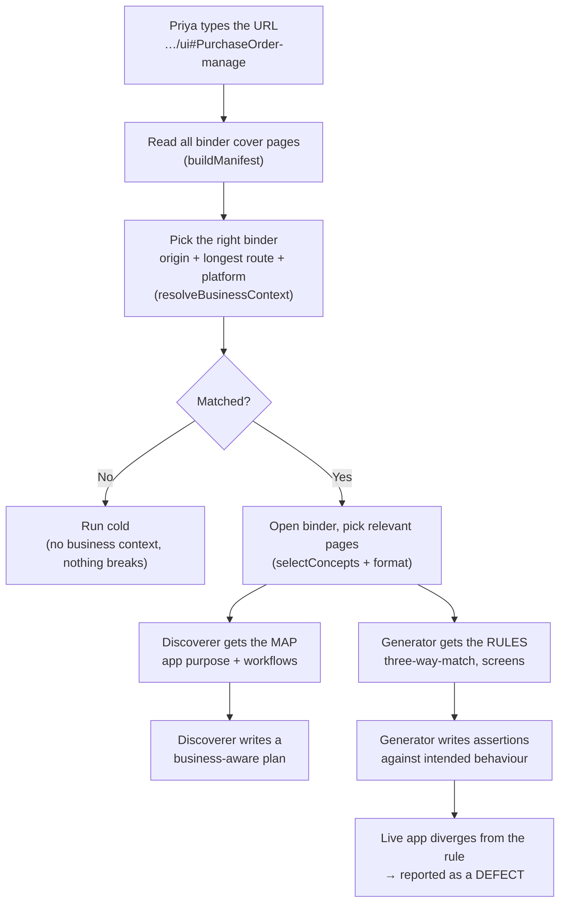

# Tutorial — Giving the Testing Agents Business Knowledge with OKF

> Status: **Implemented** (lexical selection) · Date: 2026-06-14
> Audience: anyone on the team — no deep code knowledge needed.
> Goal: explain, in plain English and step by step, how our testing tool reads
> human-written "business context" (in the **Open Knowledge Format**, OKF) and
> uses it to test an app the way a person who already knows the product would.
> We follow one running example — **Priya testing a SAP Fiori app** — from the
> moment she types a URL to the moment a real bug is caught.

---

## 1. The problem, in one paragraph

Our tool points AI agents at a website and lets them crawl it and write tests.
But out of the box those agents arrive **cold** — they have no idea what the app
is _for_. They can check that pages load, but they can't check that the
_business logic_ is correct, because nobody told them what "correct" means. A
human tester who knows the product would test much deeper. **OKF is how we hand
the agents that product knowledge before they start.**

Think of it like a new contractor arriving at a building site. They're skilled,
but they still need the binder of instructions for _this_ building. OKF bundles
are those binders.

---

## 2. The cast (our running example)

- **Priya** — a QA engineer at **Northwind Materials**, a company running **SAP
  S/4HANA Cloud**.
- **The two agents:**
  - the **Discoverer** — crawls the app and writes a test _plan_.
  - the **Generator** — turns each item in that plan into an actual _test_.
- **The OKF bundles** — folders of plain-text files, written by someone who knows
  Northwind's procurement process, living in the repo under `business-context/`.

---

## 3. What an OKF bundle actually is

An OKF bundle is just **a folder of Markdown (`.md`) files**. Each file describes
one "concept" — a screen, a workflow, a business rule, a UI pattern. There's no
database, no special software, no API. You can read it in any text editor.

We keep **two kinds** of bundle:

- **`platform/`** — a _general_ handbook reused by many apps. Example:
  `platform/sap-fiori/` = "how any SAP Fiori app behaves" (tiles, filter bars,
  loading spinners, the difference between a warning and a blocking error).
- **`apps/`** — knowledge about _one specific app_. Example:
  `apps/manage-purchase-orders/` = its workflows, screens, and business rules.

### 3.1 The folder layout

```
business-context/
├── platform/
│   └── sap-fiori/                  # the general handbook
│       ├── index.md
│       ├── patterns/               # launchpad, filter bar, object page, ...
│       └── conventions/            # how to wait, error-vs-warning, ...
└── apps/
    └── manage-purchase-orders/     # the specific app binder
        ├── index.md                # the "cover page"
        ├── workflows/              # procure-to-pay, post-supplier-invoice
        ├── screens/                # po-list-report, po-object-page
        └── rules/                  # three-way-match, release-strategy
```

Every folder has an `index.md` — a short "table of contents" page. This lets an
agent (or a person) drill in gradually instead of reading everything at once.

### 3.2 What one concept file looks like

Each file has a small block of structured fields at the top (called _frontmatter_,
written in YAML between `---` lines) and plain Markdown below it:

```markdown
---
type: Business Rule
title: Three-Way Match
description: Invoice quantity vs goods-received vs PO quantity validation.
timestamp: 2026-06-14T09:00:00Z
---

# Three-Way Match

An invoice may post only when:

    invoice quantity  ≤  goods-received quantity  ≤  PO quantity

Over-delivery is allowed up to **10%** of the PO quantity. Beyond that, the post
MUST be **blocked with a hard error** — not a warning.
```

Only one field is strictly required: `type`. The rest (`title`, `description`,
`timestamp`, `resource`, `tags`) are optional but recommended.

### 3.3 The files link to each other

Concepts link to one another with ordinary Markdown links, e.g. a workflow file
saying `... see [three-way match](../rules/three-way-match.md)`. These links turn
the folder into a **graph** — a web of related ideas — which is richer than the
plain folder tree. A workflow links to the screens it uses and the rules it must
obey; an app links to the platform handbook it's built on.

### 3.4 The one special line that makes routing work

The app's cover page (`apps/manage-purchase-orders/index.md`) has three fields
that tell the tool _which website this binder is for_:

```yaml
applies_to:
  origin: https://northwind.s4hana.ondemand.com # the website
  routes: ["#PurchaseOrder-manage"] # the specific app on it
built_on: [sap-fiori] # also load this handbook
```

This matters because SAP Fiori (and Infor, and similar systems) put **dozens of
apps at the same web address**, told apart only by the bit after the `#`. So the
binder is labelled with both the address _and_ that route.

---

## 4. The end-to-end workflow, step by step

Now the main event. Priya wants to test Northwind's purchase-order app.

### Step 0 — Someone wrote the binders (one time, up front)

Before any of this runs, a business analyst at Northwind wrote the two bundles
above and committed them to the repo. They just sit there in git, version-
controlled like code. Nothing happens until a test run starts.

### Step 1 — Priya provides the URL

Priya opens the tool and pastes the address of the app she wants tested:

```
https://northwind.s4hana.ondemand.com/ui#PurchaseOrder-manage
```

She clicks **Run**.

### Step 2 — The tool reads every binder's cover page

The moment a run starts, the tool quietly scans the `business-context/` folder
**once** and reads just the cover page of every binder — not the whole binder,
just the labels — and builds a quick lookup list: "which binder is for which
website."

> In the code: `buildManifest()` in
> `src/knowledge/business/manifest.ts`. If the folder is missing or a file is
> broken, it just skips it and carries on — a bad binder never crashes a run.

### Step 3 — The tool picks the right binder for this URL

The tool takes Priya's URL and figures out which binder applies, in four small
moves:

1. **Simplify the address.** It reduces the URL to just the website:
   `https://northwind.s4hana.ondemand.com` (dropping `/ui`, the `#...`, `www`,
   capitalisation). This is the app's "identity".
2. **Match the specific app by route.** Among binders for that website, it looks
   at the part of the URL after the address (`/ui#purchaseorder-manage`) and
   finds the binder whose `routes` appears in it. If two binders could match, the
   **longer, more specific route wins** (so `#PurchaseOrder-manage` beats a
   generic `#PurchaseOrder`).
3. **Stack the general handbook.** The winning binder says `built_on: [sap-fiori]`,
   so the tool _also_ loads the SAP Fiori handbook underneath it. The agents now
   get **two layers**: the specific app binder + the general Fiori handbook.
4. **Hand back the result:** "app = Manage Purchase Orders, platform = SAP Fiori."

If nothing matched (wrong site, unknown route), the tool simply runs the old way —
cold, no binder, nothing broken.

> In the code: `resolveBusinessContext()` in
> `src/knowledge/business/resolver.ts`.

### Step 4 — The tool opens the binder and picks the right pages

A full binder can be large, so the tool does **not** dump all of it into the
agents. It selects only what each agent needs — and it does this differently for
the two agents.

**For the Discoverer — the "map" (small, always included).**
It grabs the high-level pages: the app's purpose and the **list of workflows**
("Procure to Pay", "Post a Supplier Invoice") and key screens. This is the table
of contents, so the Discoverer knows what business journeys to go looking for.

**For the Generator — the "relevant chapters" (smart selection).**
The Generator is about to write a test for a _specific_ scenario, e.g. _"post a
supplier invoice for more than was ordered."_ For that scenario, the tool compares
the scenario's wording against every concept in the binders and pulls the closest
few — here, the **Three-Way Match** rule and the **PO Object Page** screen. It
trims the result so it can never overflow the prompt.

> In the code: `selectConcepts()` (`select.ts`) ranks concepts by word overlap and
> always favours **Business Rules** (they hold the logic to assert against);
> `format.ts` renders the trimmed, ready-to-use text blocks. All orchestrated by
> `BusinessContextService` in `service.ts`.

### Step 5 — The Discoverer crawls — now knowing the business

The tool adds the Discoverer's "map" block into its instructions. Instead of
blindly clicking whatever links it sees, the Discoverer now arrives knowing:

- what the app is for (managing purchase orders),
- that it's a Fiori app (expect tiles, a filter bar, loading spinners),
- that "Procure to Pay" and "Three-Way Match" are real journeys worth testing.

So the plan it writes reflects the **real procurement process**, not just "every
page loaded". On screen, Priya sees:

```
📘 Loaded business context: Manage Purchase Orders (+ SAP Fiori)
```

### Step 6 — The Generator writes tests against intended behaviour

For each scenario, the tool adds the Generator's "rules" block. Now the Generator
isn't guessing what "correct" means — the binder told it the rule:

> invoice quantity must be ≤ goods-received ≤ PO quantity; over-delivery beyond
> **10%** must be **blocked with a hard error, not a warning.**

So instead of a shallow test ("the invoice screen opens"), it writes a meaningful
one:

> Create a PO for 100 units → post a goods receipt for 100 → try to post a
> supplier invoice for **120** units → **expect a hard error that blocks the post.**

### Step 7 — The run executes, and catches a real bug

The test runs against Northwind's live app. The app **accepts** the 120-unit
invoice and only shows a yellow **warning** instead of blocking it.

Because the Generator knew the intended rule, this mismatch is reported as a
genuine **functional defect** — over-delivery beyond tolerance should have been
blocked. A generic crawler, with no idea what the rule was, would have happily
reported "invoice posted ✓" and walked straight past the bug.

**That jump — from "does the page load" to "does the business logic hold" — is
the entire point of OKF.**

---

## 5. The whole flow as a picture



---

## 6. The safety nets (important details)

The whole feature is designed to **never** make a run worse than it was before:

- **It never blocks a run.** Missing folder, broken file, no matching binder — all
  quietly fall back to "run cold". Every method returns "nothing" rather than
  throwing an error. This mirrors the rest of our knowledge layer's
  "log, never throw" rule.
- **It never bloats the prompt.** Both the map and the rules blocks are capped
  (~6,000 and ~12,000 characters). Better to include the 3 most relevant pages in
  full than 30 pages cut off mid-sentence.
- **You can always see what it used.** Whenever a binder loads, the run prints a
  `📘` line, so there's no hidden magic.
- **Authored knowledge ≠ learned knowledge.** This binder content is _human-
  written, trusted reference_. It is kept separate from the knowledge the tool
  _learns_ from past runs, and is never overwritten by any automatic process. If
  the binder and the live app disagree, that disagreement is a **finding to
  report**, not something to silently "learn away".

---

## 7. How to add a binder for a new app (practical how-to)

1. **Copy the template.** Duplicate `business-context/apps/manage-purchase-orders/`
   to `business-context/apps/<your-app>/`.
2. **Update the cover page.** In the new `index.md`, set `title`, and the routing
   fields: `applies_to.origin` (the website), `applies_to.routes` (the app's route
   after the `#` or its path), and `built_on` (e.g. `[sap-fiori]`).
3. **Fill in the content.** Edit the files under `workflows/`, `screens/`, and
   `rules/` to describe _your_ app. Keep one concept per file. Link related
   concepts with normal Markdown links.
4. **Reuse the platform handbook.** If your app is also a Fiori app, you don't
   rewrite the Fiori handbook — `built_on: [sap-fiori]` pulls it in automatically.
5. **That's it.** Commit the folder. Next time someone runs the tool against that
   URL, the agents will be primed automatically.

**Tip:** the most valuable files are the `rules/` — they're what turns shallow
"page loaded" tests into real "the logic is correct" tests. Spend your effort
there.

---

## 8. Where everything lives (reference)

| Piece                      | File                                    | What it does                |
| -------------------------- | --------------------------------------- | --------------------------- |
| The binders                | `business-context/`                     | Human-written OKF bundles   |
| Read all cover pages       | `src/knowledge/business/manifest.ts`    | Builds the lookup list      |
| Pick the right binder      | `src/knowledge/business/resolver.ts`    | URL → app + platform        |
| Parse a file's frontmatter | `src/knowledge/business/frontmatter.ts` | Tiny YAML reader            |
| Walk the link graph        | `src/knowledge/business/links.ts`       | Link resolution + integrity |
| Load a concept             | `src/knowledge/business/concept.ts`     | `.md` → struct              |
| Pick relevant concepts     | `src/knowledge/business/select.ts`      | Ranking                     |
| Render prompt blocks       | `src/knowledge/business/format.ts`      | Budgeted text               |
| Tie it together            | `src/knowledge/business/service.ts`     | `BusinessContextService`    |
| Inject into agents         | `src/orchestrator/stages.ts`            | The two prompt seams        |
| Construct the service      | `src/orchestrator/orchestrate.ts`       | Composition root            |

---

## 9. Current limits and what's next

- **Selection is word-based ("lexical") for now.** It matches scenarios to
  concepts by overlapping words. A future upgrade swaps in _meaning-based_
  (semantic) matching so a paraphrased scenario still finds the right rule. The
  seam for this already exists.
- **Not yet proven against a live SAP tenant.** Every piece is unit-tested
  (selection, resolution, formatting, the real example bundle), but the full
  "catches the three-way-match bug" story is the _design intent_ — it still needs
  a real run against a reachable URL with the agents enabled.
- **Manual bundle override** (pinning a specific binder at launch) is designed but
  not yet exposed in the UI; automatic routing is what's wired today.

---

_For the format itself, see the
[Open Knowledge Format spec](https://github.com/GoogleCloudPlatform/knowledge-catalog/tree/main/okf).
For the example bundle and its link graph, see `business-context/README.md`._
