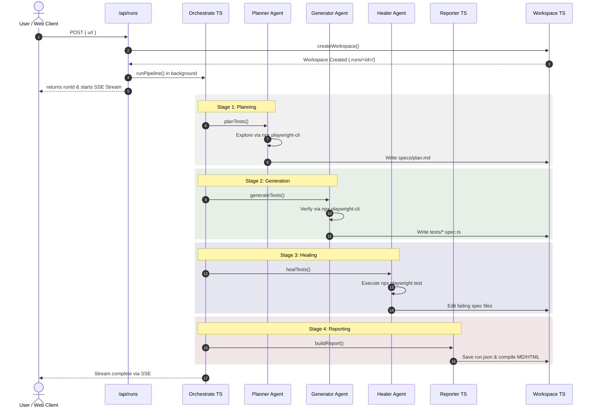

# Backend Workflow Guide — AI UI Testing Tool

This document outlines the step-by-step workflow of what happens in the background when a user submits a target URL to be tested. 

---

## High-Level Execution Timeline



---

## Detailed Step-by-Step Backend Actions

### Step 1: User Submission & Validation
* **What Happens:** The user enters a URL on the dashboard and submits the form.
* **File Called First:** [app/page.tsx](file:///Users/senthilpalanivelu/Programme/test-suite/app/page.tsx) / [app/RunForm.tsx](file:///Users/senthilpalanivelu/Programme/test-suite/app/RunForm.tsx) calls the Next.js API route via a POST request to `/api/runs`.
* **Processing:**
  1. The API route handler at [app/api/runs/route.ts](file:///Users/senthilpalanivelu/Programme/test-suite/app/api/runs/route.ts) validates the target URL and options (e.g. crawl mode, max page cap).
  2. If valid, the handler creates an in-memory run entry via the store in [src/runStore/store.ts](file:///Users/senthilpalanivelu/Programme/test-suite/src/runStore/store.ts).
  3. The handler fires off the orchestrator main pipeline asynchronously in the background.
  4. The HTTP response immediately returns the `runId` to the client so it can redirect to the progress view page at `/runs/[id]`.

---

### Step 2: Workspace Setup
* **What Happens:** The orchestrator sets up a secure, isolated workspace directory on the disk for this specific run.
* **File Called:** `runPipeline()` in [src/orchestrator/orchestrate.ts](file:///Users/senthilpalanivelu/Programme/test-suite/src/orchestrator/orchestrate.ts) calls `createWorkspace()` in [src/agents/workspace.ts](file:///Users/senthilpalanivelu/Programme/test-suite/src/agents/workspace.ts).
* **Processing:**
  1. Creates a unique subdirectory at `.runs/<runId>/`.
  2. Creates subfolders `.runs/<runId>/specs/` (where the test plan will be saved) and `.runs/<runId>/tests/` (where generated spec test files will go).
  3. Writes default configuration files like `playwright.config.ts` and a `seed.spec.ts` template file to the run directory.

---

### Step 3: Server-Sent Events (SSE) Connection
* **What Happens:** The web UI establishes a persistent connection to receive real-time streaming updates from the agents.
* **File Called:** [app/runs/[id]/page.tsx](file:///Users/senthilpalanivelu/Programme/test-suite/app/runs/[id]/page.tsx) connects to the API route at [app/api/runs/[id]/stream/route.ts](file:///Users/senthilpalanivelu/Programme/test-suite/app/api/runs/[id]/stream/route.ts).
* **Processing:**
  1. The stream handler hooks into the event emitter in [src/runStore/store.ts](file:///Users/senthilpalanivelu/Programme/test-suite/src/runStore/store.ts).
  2. As the background tasks proceed, they dispatch log messages and status updates (e.g. `Planner exploring page...`) which are pushed down to the UI stream.

---

### Step 4: Stage 1 — Planning (Crawl & Discover)
* **What Happens:** An AI agent explores the target application to identify navigations and interactive elements, producing a structured test plan.
* **File Called:** `planTests()` in [src/orchestrator/stages.ts](file:///Users/senthilpalanivelu/Programme/test-suite/src/orchestrator/stages.ts) loads the planner configuration [playwright-test-planner.md](file:///Users/senthilpalanivelu/Programme/test-suite/.claude/agents/playwright-test-planner.md) and delegates to the runtime.
* **Processing:**
  1. `runAgent()` in [src/agents/runtime.ts](file:///Users/senthilpalanivelu/Programme/test-suite/src/agents/runtime.ts) starts the Anthropic Claude Agent SDK query.
  2. The Planner agent executes shell commands using the native `Bash` tool to run `npx playwright-cli open <url> -s=session1`.
  3. It analyzes accessibility snapshots by running `npx playwright-cli snapshot -s=session1`.
  4. It interacts with the site dynamically (clicking links, inputs) via commands like `npx playwright-cli click <ref> -s=session1` to crawl deeper.
  5. Once finished, the Planner agent saves its structured plan to `.runs/<runId>/specs/plan.md` using the SDK's built-in `Write` tool.

---

### Step 5: Stage 2 — Generation (Writing Test Code)
* **What Happens:** An agent translates the Markdown test plan into executable Playwright test specs.
* **File Called:** `generateTests()` in [src/orchestrator/stages.ts](file:///Users/senthilpalanivelu/Programme/test-suite/src/orchestrator/stages.ts) loads [playwright-test-generator.md](file:///Users/senthilpalanivelu/Programme/test-suite/.claude/agents/playwright-test-generator.md).
* **Processing:**
  1. The Generator agent reads `.runs/<runId>/specs/plan.md` using the SDK's built-in `Read` tool.
  2. For each plan section, it walks through the planned steps, spinning up a persistent session via `npx playwright-cli open` to manually verify selectors and interactions.
  3. It groups related test cases into single narrative files (e.g. `tests/navigation-header.spec.ts`).
  4. It outputs the compiled, syntactically correct TypeScript test code directly to the `.runs/<runId>/tests/` directory using the SDK's built-in `Write` tool.

---

### Step 6: Stage 3 — Healing (Running & Auto-Repairing Tests)
* **What Happens:** The newly generated tests are executed, checked for errors, and healed if elements or locators fail.
* **File Called:** `healTests()` in [src/orchestrator/stages.ts](file:///Users/senthilpalanivelu/Programme/test-suite/src/orchestrator/stages.ts) loads [playwright-test-healer.md](file:///Users/senthilpalanivelu/Programme/test-suite/.claude/agents/playwright-test-healer.md).
* **Processing:**
  1. The Healer agent runs the initial test suite execution:
     ```bash
     npx playwright test
     ```
     via the `Bash` tool.
  2. For any test cases that fail (due to dynamic IDs, incorrect assertions, or broken selectors), it executes them individually:
     ```bash
     npx playwright test tests/failing-spec.spec.ts
     ```
  3. It uses `playwright-cli` commands (like `npx playwright-cli screenshot` and `snapshot`) on the failed state to inspect why it broke.
  4. It corrects the code using `Edit` or `MultiEdit` tools to update locator selectors or assertions.
  5. It re-runs the test. If a test remains broken after multiple attempts, it marks it with `test.fixme()` so it is safely quarantined rather than reported as false success.

---

### Step 7: Stage 4 — Reporting (Assembling the Report)
* **What Happens:** The test run outcomes are analyzed, bucketed, narrated, and compiled into human- and machine-readable reports.
* **Files Called:**
  * [src/orchestrator/orchestrate.ts](file:///Users/senthilpalanivelu/Programme/test-suite/src/orchestrator/orchestrate.ts) calls `buildReport()` in [src/reporter/report.ts](file:///Users/senthilpalanivelu/Programme/test-suite/src/reporter/report.ts).
  * `buildReport` delegates to [src/reporter/successRate.ts](file:///Users/senthilpalanivelu/Programme/test-suite/src/reporter/successRate.ts) and [src/reporter/narrative.ts](file:///Users/senthilpalanivelu/Programme/test-suite/src/reporter/narrative.ts).
* **Processing:**
  1. The Playwright JSON output from the healing run (`results.json`) is parsed.
  2. **Metrics calculation:** Computes success rates, bucket classifications (Passed, Needs Attention, Where to Improve), coverage percentage against curated flows, and flakiness rates.
  3. **AI Narrative:** Calls Claude via [src/claude/client.ts](file:///Users/senthilpalanivelu/Programme/test-suite/src/claude/client.ts) to read failure details and generate human-friendly recommendations, issues found, and concrete fix prompts.
  4. **Output Rendering:** [src/reporter/render.ts](file:///Users/senthilpalanivelu/Programme/test-suite/src/reporter/render.ts) renders this compiled dataset into static Markdown (`report.md`) and HTML (`report.html`) formats.
  5. **Persistence:** The final JSON payload is saved to `.runs/<runId>/run.json` using the workspace persistence helpers in [src/agents/workspace.ts](file:///Users/senthilpalanivelu/Programme/test-suite/src/agents/workspace.ts).

---

### Step 8: Rendering the Finished Report
* **What Happens:** The web UI receives the finished event over SSE, pulls the final report data, and renders the interactive dashboard.
* **File Called:** [app/runs/[id]/page.tsx](file:///Users/senthilpalanivelu/Programme/test-suite/app/runs/[id]/page.tsx) calls `/api/runs/[id]/report` route defined in [app/api/runs/[id]/report/route.ts](file:///Users/senthilpalanivelu/Programme/test-suite/app/api/runs/[id]/report/route.ts).
* **Processing:**
  1. The API route loads the `run.json` report data from disk.
  2. The page renders the summary cards, the download options (MD/HTML/JSON), and updates the **Code View tab** to display both the final [plan.md](file:///Users/senthilpalanivelu/Programme/test-suite/specs/ai-ui-testing-tool/plan.md) and all generated Playwright `.spec.ts` source codes.
